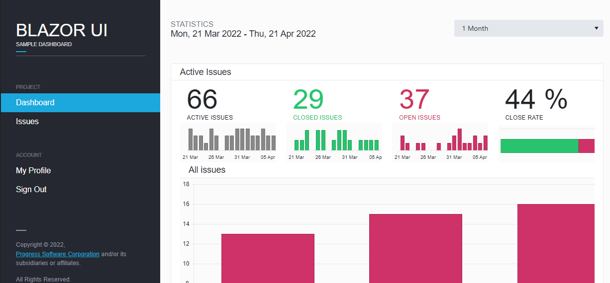
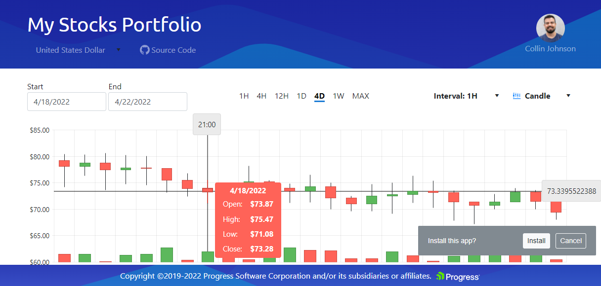
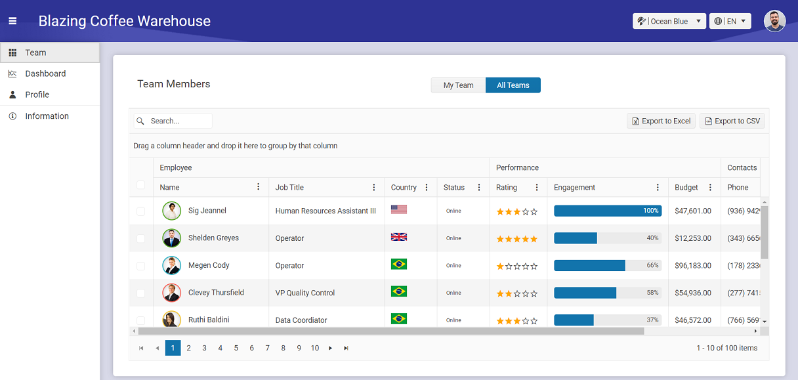

# Telerik UI for Blazor Components and Sample Apps

Telerik UI for Blazor enables you to develop new Blazor applications and modernize legacy web projects in half the time with a high-performing Blazor Data Grid and 100+ truly native, easy-to-customize UI components to cover any requirement.

This repository contains examples related to [Telerik UI for Blazor components](https://www.telerik.com/blazor-ui?utm_medium=referral&utm_source=github&utm_campaign=blazor-awareness-components-examples-github) that can be used in addition to the existing documentation or demos. They provide scenarios and answers to common how-to questions related to:
* [Blazor Data Grid](https://www.telerik.com/blazor-ui/grid?utm_medium=referral&utm_source=github&utm_campaign=blazor-awareness-components-examples-github)
* [Blazor Chart](https://www.telerik.com/blazor-ui/chart?utm_medium=referral&utm_source=github&utm_campaign=blazor-awareness-components-examples-github)
* [Blazor Editor](https://www.telerik.com/blazor-ui/editor?utm_medium=referral&utm_source=github&utm_campaign=blazor-awareness-components-examples-github)
* [Blazor Drawer](https://www.telerik.com/blazor-ui/drawer?utm_medium=referral&utm_source=github&utm_campaign=blazor-awareness-components-examples-github)
* [Blazor Scheduler](https://www.telerik.com/blazor-ui/scheduler?utm_medium=referral&utm_source=github&utm_campaign=blazor-awareness-components-examples-github) and more.

The included code examples are applicable for both Blazor WebAssembly and Blazor Server projects. For most of them, a component and some classes are provided to illustrate a specific use case can be achieved. 

> **NOTE**: This repository does not contain the actual source code of the components, or the demos application available at the official UI for Blazor demos. The demos application is available as an offline project from your Telerik UI for Blazor installation.
***
## Table of Contents

* [Common Support Questions](#common-support-questions)
  * [Where can I find help?](#where-can-i-find-help)
  * [When do you plan to release feature X?](#when-do-you-plan-to-release-feature-x)
  * [Where do I make suggestions?](#where-do-i-make-suggestions)
* [Blazor UI Components](#blazor-ui-components)
* [Design to development](#design-to-development-support)
* [Sample Applications](#sample-applications)
  * [Task Tracker Dashboard](#blazor-dashboard-application)
  * [Financial Portfolio](#blazor-stocks-application)
  * [Coffee Warehouse Dashboard](#blazor-coffee-warehouse-application)
* [Package References](#package-references)
* [Contribution](#contribution)
* [Licensing](#licensing)
* [Useful Links](#useful-links)
***

## Common Support Questions

### Where can I find help?

1. For community support, we recommend asking questions on Stack Overflow using the [telerik-blazor tag](http://stackoverflow.com/questions/tagged/telerik-blazor).
2. If you have an active trial or license, you can use the official [support channel](https://www.telerik.com/account/support-tickets?utm_medium=referral&utm_source=github&utm_campaign=blazor-awareness-components-examples-github) for questions, technical assistance, bug reports or problem resolutions. 

  
### When do you plan to release feature X
Check the [Telerik UI for Blazor Roadmap](https://www.telerik.com/support/whats-new/blazor-ui/roadmap?utm_medium=referral&utm_source=github&utm_campaign=blazor-awareness-components-examples-github) to see a list of components, features and tooling we have planned.

### Where do I make suggestions?

If your feature isn’t listed in the product roadmap, check our dedicated [feedback portal](https://feedback.telerik.com/blazor?utm_medium=referral&utm_source=github&utm_campaign=blazor-awareness-components-examples-github). You can upvote existing requested items or If you don’t see your feature on our portal, you can request the feature there.

## Blazor UI Components

### Blazor Data Management
<table><tbody>
<tr>
  <td><b>Blazor DataGrid Component</b></td>
  <td><a href="https://www.telerik.com/blazor-ui/grid?utm_medium=referral&utm_source=github&utm_campaign=blazor-awareness-components-examples-github">Gird Features</a></td>
  <td><a href="https://docs.telerik.com/blazor-ui/components/grid/overview?utm_medium=referral&utm_source=github&utm_campaign=blazor-awareness-components-examples-github">Data Grid Documentation</td>
  <td><a href="https://demos.telerik.com/blazor-ui/grid/overview?utm_medium=referral&utm_source=github&utm_campaign=blazor-awareness-components-examples-github">Data Grid Demos</td>
</tr>
 <tr>
  <td><b>Blazor ListView Component</b></td>
  <td><a href="https://www.telerik.com/blazor-ui/listview?utm_medium=referral&utm_source=github&utm_campaign=blazor-awareness-components-examples-github">List View Features</a></td>
  <td><a href="https://docs.telerik.com/blazor-ui/components/listview/overview?utm_medium=referral&utm_source=github&utm_campaign=blazor-awareness-components-examples-github">ListView Documentation</td>
  <td><a href="https://demos.telerik.com/blazor-ui/listview/overview?utm_medium=referral&utm_source=github&utm_campaign=blazor-awareness-components-examples-github">ListView Demos</td>
</tr> 
 <tr>
  <td><b>Blazor TreeList Component</b></td>
  <td><a href="https://www.telerik.com/blazor-ui/treelist">Tree List Features</a></td>
  <td><a href="https://docs.telerik.com/blazor-ui/components/treelist/overview">TreeList Documentation</td>
  <td><a href="https://demos.telerik.com/blazor-ui/treelist/overview">TreeList Demos</td>
</tr> 
 <tr>
  <td><b>Blazor Filter Component</b></td>
  <td><a href="https://www.telerik.com/blazor-ui/filter?utm_medium=referral&utm_source=github&utm_campaign=blazor-awareness-components-examples-github">Filter Features</a></td>
  <td><a href="https://docs.telerik.com/blazor-ui/components/filter/overview?utm_medium=referral&utm_source=github&utm_campaign=blazor-awareness-components-examples-github">Filter Documentation</td>
  <td><a href="https://demos.telerik.com/blazor-ui/filter/overview?utm_medium=referral&utm_source=github&utm_campaign=blazor-awareness-components-examples-github">Filter Demos</td>
</tr> 
<tr>
  <td><b>Blazor Pager Component</b></td>
  <td><a href="https://www.telerik.com/blazor-ui/pager?utm_medium=referral&utm_source=github&utm_campaign=blazor-awareness-components-examples-github">Pager Features</a></td>
  <td><a href="https://docs.telerik.com/blazor-ui/components/pager/overview?utm_medium=referral&utm_source=github&utm_campaign=blazor-awareness-components-examples-github">Pager Documentation</td>
  <td><a href="https://demos.telerik.com/blazor-ui/pager/overview?utm_medium=referral&utm_source=github&utm_campaign=blazor-awareness-components-examples-github">Pager Demos</td>
</tr> 
</tbody></table>

### Blazor File Management
<table><tbody>
<tr>
  <td><b>Blazor File Manager</b></td>
  <td><a href="https://www.telerik.com/blazor-ui/file-manager?utm_medium=referral&utm_source=github&utm_campaign=blazor-awareness-components-examples-github">FileManager Features</a></td>
  <td><a href="https://docs.telerik.com/blazor-ui/components/filemanager/overview?utm_medium=referral&utm_source=github&utm_campaign=blazor-awareness-components-examples-github">FileManager Documentation</td>
  <td><a href="https://demos.telerik.com/blazor-ui/filemanager/overview?utm_medium=referral&utm_source=github&utm_campaign=blazor-awareness-components-examples-github">FileManager Demos</td>
</tr>
<tr>
  <td><b>Blazor FileUpload Component</b></td>
  <td><a href="https://www.telerik.com/blazor-ui/upload?utm_medium=referral&utm_source=github&utm_campaign=blazor-awareness-components-examples-github">File Upload Features</a></td>
  <td><a href="https://docs.telerik.com/blazor-ui/components/upload/overview?utm_medium=referral&utm_source=github&utm_campaign=blazor-awareness-components-examples-github">FileUpload Documentation</td>
  <td><a href="https://demos.telerik.com/blazor-ui/upload/overview?utm_medium=referral&utm_source=github&utm_campaign=blazor-awareness-components-examples-github">FileUpload Demos</td>
</tr>
<tr>
  <td><b>Blazor FileSelect Component</b></td>
  <td><a href="https://www.telerik.com/blazor-ui/fileselect?utm_medium=referral&utm_source=github&utm_campaign=blazor-awareness-components-examples-github">File Select Features</a></td>
  <td><a href="https://docs.telerik.com/blazor-ui/components/fileselect/overview?utm_medium=referral&utm_source=github&utm_campaign=blazor-awareness-components-examples-github">FileSelect Documentation</td>
  <td><a href="https://demos.telerik.com/blazor-ui/fileselect/overview?utm_medium=referral&utm_source=github&utm_campaign=blazor-awareness-components-examples-github">FileSelect Demos</td>
</tr>
</tbody></table>

### Blazor Geo Visualization
<table><tbody>
<tr>
  <td><b>Blazor Map Component</b></td>
  <td><a href="https://www.telerik.com/blazor-ui/map?utm_medium=referral&utm_source=github&utm_campaign=blazor-awareness-components-examples-github">Map Features</a></td>
  <td><a href="https://docs.telerik.com/blazor-ui/components/map/overview?utm_medium=referral&utm_source=github&utm_campaign=blazor-awareness-components-examples-github">Map Documentation</td>
  <td><a href="https://demos.telerik.com/blazor-ui/map/overview?utm_medium=referral&utm_source=github&utm_campaign=blazor-awareness-components-examples-github">Map Demos</td>
</tr>   
</tbody></table>

### Blazor Scheduling Components
<table><tbody>
<tr>
  <td><b>Blazor Calendar Component</b></td>
  <td><a href="https://www.telerik.com/blazor-ui/calendar?utm_medium=referral&utm_source=github&utm_campaign=blazor-awareness-components-examples-github">Calendar Features</a></td>
  <td><a href="https://docs.telerik.com/blazor-ui/components/calendar/overview?utm_medium=referral&utm_source=github&utm_campaign=blazor-awareness-components-examples-github">Calendar Documentation</td>
  <td><a href="https://demos.telerik.com/blazor-ui/calendar/overview?utm_medium=referral&utm_source=github&utm_campaign=blazor-awareness-components-examples-github">Calendar Demos</td>
</tr>
<tr>
  <td><b>Blazor Gantt Component</b></td>
  <td><a href="https://www.telerik.com/blazor-ui/gantt?utm_medium=referral&utm_source=github&utm_campaign=blazor-awareness-components-examples-github">Gantt Features</a></td>
  <td><a href="https://docs.telerik.com/blazor-ui/components/gantt/overview?utm_medium=referral&utm_source=github&utm_campaign=blazor-awareness-components-examples-github">Gantt Documentation</td>
  <td><a href="https://demos.telerik.com/blazor-ui/gantt/overview?utm_medium=referral&utm_source=github&utm_campaign=blazor-awareness-components-examples-github">Gantt Demos</td>
</tr> 
<tr>
  <td><b>Blazor Scheduler Component</b></td>
  <td><a href="https://www.telerik.com/blazor-ui/scheduler?utm_medium=referral&utm_source=github&utm_campaign=blazor-awareness-components-examples-github">Scheduler Features</a></td>
  <td><a href="https://docs.telerik.com/blazor-ui/components/scheduler/overview?utm_medium=referral&utm_source=github&utm_campaign=blazor-awareness-components-examples-github">Scheduler Documentation</td>
  <td><a href="https://demos.telerik.com/blazor-ui/scheduler/overview?utm_medium=referral&utm_source=github&utm_campaign=blazor-awareness-components-examples-github">Scheduler Demos</td>
</tr> 
</tbody></table>

### Blazor Editor Components
<table><tbody>
<tr>
  <td><b>Blazor AutoComplete Component</b></td>
  <td><a href="https://www.telerik.com/blazor-ui/autocomplete?utm_medium=referral&utm_source=github&utm_campaign=blazor-awareness-components-examples-github">AutoComplete Features</a></td>
  <td><a href="https://docs.telerik.com/blazor-ui/components/autocomplete/overview?utm_medium=referral&utm_source=github&utm_campaign=blazor-awareness-components-examples-github">AutoComplete Documentation</td>
  <td><a href="https://demos.telerik.com/blazor-ui/autocomplete/overview?utm_medium=referral&utm_source=github&utm_campaign=blazor-awareness-components-examples-github">AutoComplete Demos</td>
</tr>
<tr>
  <td><b>Blazor Checkbox Component</b></td>
  <td><a href="https://www.telerik.com/blazor-ui/checkbox?utm_medium=referral&utm_source=github&utm_campaign=blazor-awareness-components-examples-github">Checkbox Features</a></td>
  <td><a href="https://docs.telerik.com/blazor-ui/components/checkbox/overview?utm_medium=referral&utm_source=github&utm_campaign=blazor-awareness-components-examples-github">Checkbox Documentation</td>
  <td><a href="https://demos.telerik.com/blazor-ui/checkbox/overview?utm_medium=referral&utm_source=github&utm_campaign=blazor-awareness-components-examples-github">Checkbox Demos</td>
</tr>
<tr>
  <td><b>Blazor ColorGradient Component</b></td>
  <td><a href="https://www.telerik.com/blazor-ui/colorgradient?utm_medium=referral&utm_source=github&utm_campaign=blazor-awareness-components-examples-github">Color Gradient Features</a></td>
  <td><a href="https://docs.telerik.com/blazor-ui/components/colorgradient/overview?utm_medium=referral&utm_source=github&utm_campaign=blazor-awareness-components-examples-github">Color Gradient Documentation</td>
  <td><a href="https://demos.telerik.com/blazor-ui/colorgradient/overview?utm_medium=referral&utm_source=github&utm_campaign=blazor-awareness-components-examples-github">Color Gradient Demos</td>
</tr>
<tr>
  <td><b>Blazor ColorPalette Component</b></td>
  <td><a href="https://www.telerik.com/blazor-ui/colorpalette?utm_medium=referral&utm_source=github&utm_campaign=blazor-awareness-components-examples-github">Color Palette Features</a></td>
  <td><a href="https://docs.telerik.com/blazor-ui/components/colorpalette/overview?utm_medium=referral&utm_source=github&utm_campaign=blazor-awareness-components-examples-github">ColorPalette Documentation</td>
  <td><a href="https://demos.telerik.com/blazor-ui/colorpalette/overview?utm_medium=referral&utm_source=github&utm_campaign=blazor-awareness-components-examples-github">ColorPalette Demos</td>
</tr>
<tr>
  <td><b>Blazor ColorPicker Component</b></td>
  <td><a href="https://www.telerik.com/blazor-ui/colorpicker?utm_medium=referral&utm_source=github&utm_campaign=blazor-awareness-components-examples-github">Color Picker Features</a></td>
  <td><a href="https://docs.telerik.com/blazor-ui/components/colorpicker/overview?utm_medium=referral&utm_source=github&utm_campaign=blazor-awareness-components-examples-github">ColorPicker Documentation</td>
  <td><a href="https://demos.telerik.com/blazor-ui/colorpicker/overview?utm_medium=referral&utm_source=github&utm_campaign=blazor-awareness-components-examples-github">ColorPicker Demos</td>
</tr>
<tr>
  <td><b>Blazor FlatColorPicker Component</b></td>
  <td><a href="https://www.telerik.com/blazor-ui/flatcolorpicker?utm_medium=referral&utm_source=github&utm_campaign=blazor-awareness-components-examples-github">Flat Color Picker Features</a></td>
  <td><a href="https://docs.telerik.com/blazor-ui/components/flatcolorpicker/overview?utm_medium=referral&utm_source=github&utm_campaign=blazor-awareness-components-examples-github">FlatColorPicker Documentation</td>
  <td><a href="https://demos.telerik.com/blazor-ui/flatcolorpicker/overview?utm_medium=referral&utm_source=github&utm_campaign=blazor-awareness-components-examples-github">FlatColorPicker Demos</td>
</tr>
<tr>
  <td><b>Blazor ComboBox Component</b></td>
  <td><a href="https://www.telerik.com/blazor-ui/combobox?utm_medium=referral&utm_source=github&utm_campaign=blazor-awareness-components-examples-github">ComboBox Features</a></td>
  <td><a href="https://docs.telerik.com/blazor-ui/components/combobox/overview?utm_medium=referral&utm_source=github&utm_campaign=blazor-awareness-components-examples-github">ComboBox Documentation</td>
  <td><a href="https://demos.telerik.com/blazor-ui/combobox/overview?utm_medium=referral&utm_source=github&utm_campaign=blazor-awareness-components-examples-github">ComboBox Demos</td>
</tr>
<tr>
  <td><b>Blazor DateInput Component</b></td>
  <td><a href="https://www.telerik.com/blazor-ui/date-input?utm_medium=referral&utm_source=github&utm_campaign=blazor-awareness-components-examples-github">Date Input Features</a></td>
  <td><a href="https://docs.telerik.com/blazor-ui/components/dateinput/overview?utm_medium=referral&utm_source=github&utm_campaign=blazor-awareness-components-examples-github">DateInput Documentation</td>
  <td><a href="https://demos.telerik.com/blazor-ui/dateinput/overview?utm_medium=referral&utm_source=github&utm_campaign=blazor-awareness-components-examples-github">DateInput Demos</td>
</tr>
<tr>
  <td><b>Blazor DatePicker Component</b></td>
  <td><a href="https://www.telerik.com/blazor-ui/datepicker?utm_medium=referral&utm_source=github&utm_campaign=blazor-awareness-components-examples-github">Date Picker Features</a></td>
  <td><a href="https://docs.telerik.com/blazor-ui/components/datepicker/overview?utm_medium=referral&utm_source=github&utm_campaign=blazor-awareness-components-examples-github">DatePicker Documentation</td>
  <td><a href="https://demos.telerik.com/blazor-ui/datepicker/overview?utm_medium=referral&utm_source=github&utm_campaign=blazor-awareness-components-examples-github">DatePicker Demos</td>
</tr>
<tr>
  <td><b>Blazor DateRangePicker Component</b></td>
  <td><a href="https://www.telerik.com/blazor-ui/daterange-picker?utm_medium=referral&utm_source=github&utm_campaign=blazor-awareness-components-examples-github">DateRangePicker Features</a></td>
  <td><a href="https://docs.telerik.com/blazor-ui/components/daterangepicker/overview?utm_medium=referral&utm_source=github&utm_campaign=blazor-awareness-components-examples-github">DateRangePicker Documentation</td>
  <td><a href="https://demos.telerik.com/blazor-ui/daterangepicker/overview?utm_medium=referral&utm_source=github&utm_campaign=blazor-awareness-components-examples-github">DateRangePicker Demos</td>
</tr>
 <tr>
  <td><b>Blazor DateTimePicker Component</b></td>
  <td><a href="https://www.telerik.com/blazor-ui/datetimepicker?utm_medium=referral&utm_source=github&utm_campaign=blazor-awareness-components-examples-github">DateTimePicker Features</a></td>
  <td><a href="https://docs.telerik.com/blazor-ui/components/datetimepicker/overview?utm_medium=referral&utm_source=github&utm_campaign=blazor-awareness-components-examples-github">DateTimePicker Documentation</td>
  <td><a href="https://demos.telerik.com/blazor-ui/datetimepicker/overview?utm_medium=referral&utm_source=github&utm_campaign=blazor-awareness-components-examples-github">DateTimePicker Demos</td>
</tr>
 <tr>
  <td><b>Blazor TimePicker Component</b></td>
  <td><a href="https://www.telerik.com/blazor-ui/timepicker?utm_medium=referral&utm_source=github&utm_campaign=blazor-awareness-components-examples-github">Time Picker Features</a></td>
  <td><a href="https://docs.telerik.com/blazor-ui/components/timepicker/overview?utm_medium=referral&utm_source=github&utm_campaign=blazor-awareness-components-examples-github">TimePicker Documentation</td>
  <td><a href="https://demos.telerik.com/blazor-ui/timepicker/overview?utm_medium=referral&utm_source=github&utm_campaign=blazor-awareness-components-examples-github">TimePicker Demos</td>
</tr>
 <tr>
  <td><b>Blazor DropDownList Component</b></td>
  <td><a href="https://www.telerik.com/blazor-ui/dropdownlist?utm_medium=referral&utm_source=github&utm_campaign=blazor-awareness-components-examples-github">DropDownList Features</a></td>
  <td><a href="https://docs.telerik.com/blazor-ui/components/dropdownlist/overview?utm_medium=referral&utm_source=github&utm_campaign=blazor-awareness-components-examples-github">DropDownList Documentation</td>
  <td><a href="https://demos.telerik.com/blazor-ui/dropdownlist/overview?utm_medium=referral&utm_source=github&utm_campaign=blazor-awareness-components-examples-github">DropDownList Demos</td>
</tr>
<tr>
  <td><b>Blazor MaskedTextBox Component</b></td>
  <td><a href="https://www.telerik.com/blazor-ui/maskedtextbox?utm_medium=referral&utm_source=github&utm_campaign=blazor-awareness-components-examples-github">MaskedTextBox Features</a></td>
  <td><a href="https://docs.telerik.com/blazor-ui/components/maskedtextbox/overview?utm_medium=referral&utm_source=github&utm_campaign=blazor-awareness-components-examples-github">MaskedTextBox Documentation</td>
  <td><a href="https://demos.telerik.com/blazor-ui/maskedtextbox/overview?utm_medium=referral&utm_source=github&utm_campaign=blazor-awareness-components-examples-github">MaskedTextBox Demos</td>
</tr>
<tr>
  <td><b>Blazor MultiSelect Component</b></td>
  <td><a href="https://www.telerik.com/blazor-ui/multiselect?utm_medium=referral&utm_source=github&utm_campaign=blazor-awareness-components-examples-github">Multi Select Features</a></td>
  <td><a href="https://docs.telerik.com/blazor-ui/components/multiselect/overview?utm_medium=referral&utm_source=github&utm_campaign=blazor-awareness-components-examples-github">MultiSelect Documentation</td>
  <td><a href="https://demos.telerik.com/blazor-ui/multiselect?utm_medium=referral&utm_source=github&utm_campaign=blazor-awareness-components-examples-github">MultiSelect Demos</td>
</tr>
<tr>
  <td><b>Blazor MultiColumnComboBox Component</b></td>
  <td><a href="https://www.telerik.com/blazor-ui/multicolumncombobox?utm_medium=referral&utm_source=github&utm_campaign=blazor-awareness-components-examples-github">MultiColumn ComboBox Features</a></td>
  <td><a href="https://docs.telerik.com/blazor-ui/components/multicolumncombobox/overview?utm_medium=referral&utm_source=github&utm_campaign=blazor-awareness-components-examples-github">MultiColumn ComboBox Documentation</td>
  <td><a href="https://demos.telerik.com/blazor-ui/multicolumncombobox?utm_medium=referral&utm_source=github&utm_campaign=blazor-awareness-components-examples-github">MultiColumn ComboBox Demos</td>
</tr>
<tr>
  <td><b>Blazor NumericTextBox Component</b></td>
  <td><a href="https://www.telerik.com/blazor-ui/numeric-textbox?utm_medium=referral&utm_source=github&utm_campaign=blazor-awareness-components-examples-github">Numeric TextBox Features</a></td>
  <td><a href="https://docs.telerik.com/blazor-ui/components/numerictextbox/overview?utm_medium=referral&utm_source=github&utm_campaign=blazor-awareness-components-examples-github">NumericTextBox Documentation</td>
  <td><a href="https://demos.telerik.com/blazor-ui/numerictextbox/overview?utm_medium=referral&utm_source=github&utm_campaign=blazor-awareness-components-examples-github">NumericTextBox Demos</td>
</tr>
<tr>
  <td><b>Blazor RadioGroup Component</b></td>
  <td><a href="https://www.telerik.com/blazor-ui/radiogroup?utm_medium=referral&utm_source=github&utm_campaign=blazor-awareness-components-examples-github">Radio Group Features</a></td>
  <td><a href="https://docs.telerik.com/blazor-ui/components/radiogroup/overview?utm_medium=referral&utm_source=github&utm_campaign=blazor-awareness-components-examples-github">RadioGroup Documentation</td>
  <td><a href="https://demos.telerik.com/blazor-ui/radiogroup/overview?utm_medium=referral&utm_source=github&utm_campaign=blazor-awareness-components-examples-github">RadioGroup Demos</td>
</tr>
<tr>
  <td><b>Blazor Editor Component</b></td>
  <td><a href="https://www.telerik.com/blazor-ui/editor?utm_medium=referral&utm_source=github&utm_campaign=blazor-awareness-components-examples-github">Editor Features</a></td>
  <td><a href="https://docs.telerik.com/blazor-ui/components/editor/overview?utm_medium=referral&utm_source=github&utm_campaign=blazor-awareness-components-examples-github"> Editor Documentation</td>
  <td><a href="https://demos.telerik.com/blazor-ui/editor/overview?utm_medium=referral&utm_source=github&utm_campaign=blazor-awareness-components-examples-github">Editor Demos</td>
</tr>
<tr>
  <td><b>Blazor TextArea Component</b></td>
  <td><a href="https://www.telerik.com/blazor-ui/textarea?utm_medium=referral&utm_source=github&utm_campaign=blazor-awareness-components-examples-github">Text Area Features</a></td>
  <td><a href="https://docs.telerik.com/blazor-ui/components/textarea/overview?utm_medium=referral&utm_source=github&utm_campaign=blazor-awareness-components-examples-github">TextArea Documentation</td>
  <td><a href="https://demos.telerik.com/blazor-ui/textarea/overview?utm_medium=referral&utm_source=github&utm_campaign=blazor-awareness-components-examples-github">TextArea Demos</td>
</tr>
<tr>
  <td><b>Blazor TextBox Component</b></td>
  <td><a href="https://www.telerik.com/blazor-ui/textbox?utm_medium=referral&utm_source=github&utm_campaign=blazor-awareness-components-examples-github">TextBox Features</a></td>
  <td><a href="https://docs.telerik.com/blazor-ui/components/textbox/overview?utm_medium=referral&utm_source=github&utm_campaign=blazor-awareness-components-examples-github">TextBox Documentation</td>
  <td><a href="https://demos.telerik.com/blazor-ui/textbox/overview?utm_medium=referral&utm_source=github&utm_campaign=blazor-awareness-components-examples-github">TextBox Demos</td>
</tr>
<tr>
  <td><b>Blazor Signature Component</b></td>
  <td><a href="https://www.telerik.com/blazor-ui/signature?utm_medium=referral&utm_source=github&utm_campaign=blazor-awareness-components-examples-github">Signature Features</a></td>
  <td><a href="https://docs.telerik.com/blazor-ui/components/signature/overview?utm_medium=referral&utm_source=github&utm_campaign=blazor-awareness-components-examples-github">Signature Documentation</td>
  <td><a href="https://demos.telerik.com/blazor-ui/signature/overview?utm_medium=referral&utm_source=github&utm_campaign=blazor-awareness-components-examples-github">Signature Demos</td>
</tr>
<tr>
  <td><b>Blazor Slider Component</b></td>
  <td><a href="https://www.telerik.com/blazor-ui/slider?utm_medium=referral&utm_source=github&utm_campaign=blazor-awareness-components-examples-github">Slider Features</a></td>
  <td><a href="https://docs.telerik.com/blazor-ui/components/slider/overview?utm_medium=referral&utm_source=github&utm_campaign=blazor-awareness-components-examples-github">Slider Documentation</td>
  <td><a href="https://demos.telerik.com/blazor-ui/slider/overview?utm_medium=referral&utm_source=github&utm_campaign=blazor-awareness-components-examples-github">Slider Demos</td>
</tr>
<tr>
  <td><b>Blazor RangeSlider Component</b></td>
  <td><a href="https://www.telerik.com/blazor-ui/rangeslider?utm_medium=referral&utm_source=github&utm_campaign=blazor-awareness-components-examples-github">RangeSlider Features</a></td>
  <td><a href="https://docs.telerik.com/blazor-ui/components/rangeslider/overview?utm_medium=referral&utm_source=github&utm_campaign=blazor-awareness-components-examples-github">RangeSlider Documentation</td>
  <td><a href="https://demos.telerik.com/blazor-ui/rangeslider/overview?utm_medium=referral&utm_source=github&utm_campaign=blazor-awareness-components-examples-github">RangeSlider Demos</td>
</tr>
<tr>
  <td><b>Blazor Switch Component</b></td>
  <td><a href="https://www.telerik.com/blazor-ui/switch?utm_medium=referral&utm_source=github&utm_campaign=blazor-awareness-components-examples-github">Switch Features</a></td>
  <td><a href="https://docs.telerik.com/blazor-ui/components/switch/overview?utm_medium=referral&utm_source=github&utm_campaign=blazor-awareness-components-examples-github">Switch Documentation</td>
  <td><a href="https://demos.telerik.com/blazor-ui/switch/overview?utm_medium=referral&utm_source=github&utm_campaign=blazor-awareness-components-examples-github">Switch Demos</td>
</tr>
<tr>
  <td><b>Blazor ValidationMessage Component</b></td>
  <td><a href="https://www.telerik.com/blazor-ui/validation-message?utm_medium=referral&utm_source=github&utm_campaign=blazor-awareness-components-examples-github">ValidationMessage Features</a></td>
  <td><a href="https://docs.telerik.com/blazor-ui/components/validation/message?utm_medium=referral&utm_source=github&utm_campaign=blazor-awareness-components-examples-github">ValidationMessage Documentation</td>
  <td><a href="https://demos.telerik.com/blazor-ui/validation/validation-message/template?utm_medium=referral&utm_source=github&utm_campaign=blazor-awareness-components-examples-github">ValidationMessage Demos</td>
</tr>
<tr>
  <td><b>Blazor ValidationSummary Component</b></td>
  <td><a href="https://www.telerik.com/blazor-ui/validationsummary?utm_medium=referral&utm_source=github&utm_campaign=blazor-awareness-components-examples-github">ValidationSummary Features</a></td>
  <td><a href="https://docs.telerik.com/blazor-ui/components/validation/summary?utm_medium=referral&utm_source=github&utm_campaign=blazor-awareness-components-examples-github">ValidationSummary Documentation</td>
  <td><a href="https://demos.telerik.com/blazor-ui/validation/validation-summary/template?utm_medium=referral&utm_source=github&utm_campaign=blazor-awareness-components-examples-github">ValidationSummary Demos</td>
</tr>
<tr>
  <td><b>Blazor ValidationTooltip Component</b></td>
  <td><a href="https://www.telerik.com/blazor-ui/validationtooltip?utm_medium=referral&utm_source=github&utm_campaign=blazor-awareness-components-examples-github">ValidationTooltip Features</a></td>
  <td><a href="https://docs.telerik.com/blazor-ui/components/validation/tooltip?utm_medium=referral&utm_source=github&utm_campaign=blazor-awareness-components-examples-github">ValidationTooltip Documentation</td>
  <td><a href="https://demos.telerik.com/blazor-ui/validation/validation-tooltip/template?utm_medium=referral&utm_source=github&utm_campaign=blazor-awareness-components-examples-github">ValidationTooltip Demos</td>
</tr>
</tbody></table>

### Blazor Data Visualization Components
<table><tbody>
<tr>
  <td><b>Blazor Chart Component</b></td>
  <td><a href="https://www.telerik.com/blazor-ui/chart?utm_medium=referral&utm_source=github&utm_campaign=blazor-awareness-components-examples-github">Chart Features</a></td>
  <td><a href="https://docs.telerik.com/blazor-ui/components/chart/overview?utm_medium=referral&utm_source=github&utm_campaign=blazor-awareness-components-examples-github">Chart Documentation</td>
  <td><a href="https://demos.telerik.com/blazor-ui/chart/overview?utm_medium=referral&utm_source=github&utm_campaign=blazor-awareness-components-examples-github">Chart Demos</td>
</tr>
<tr>
  <td><b>Blazor Area Chart Component</b></td>
  <td><a href="https://www.telerik.com/blazor-ui/area-chart?utm_medium=referral&utm_source=github&utm_campaign=blazor-awareness-components-examples-github">Area Chart Features</a></td>
  <td><a href="https://docs.telerik.com/blazor-ui/components/chart/types/area?utm_medium=referral&utm_source=github&utm_campaign=blazor-awareness-components-examples-github">AreaChart Documentation</td>
  <td><a href="https://demos.telerik.com/blazor-ui/chart/area-chart?utm_medium=referral&utm_source=github&utm_campaign=blazor-awareness-components-examples-github">AreaChart Demos</td>
</tr>
<tr>
  <td><b>Blazor Bar Chart Component</b></td>
  <td><a href="https://www.telerik.com/blazor-ui/bar-chart?utm_medium=referral&utm_source=github&utm_campaign=blazor-awareness-components-examples-github">Bar Chart Features</a></td>
  <td><a href="https://docs.telerik.com/blazor-ui/components/chart/types/bar?utm_medium=referral&utm_source=github&utm_campaign=blazor-awareness-components-examples-github">BarChart Documentation</td>
  <td><a href="https://demos.telerik.com/blazor-ui/chart/bar-chart?utm_medium=referral&utm_source=github&utm_campaign=blazor-awareness-components-examples-github">BarChart Demos</td>
</tr>
<tr>
  <td><b>Blazor Bubble Chart Component</b></td>
  <td><a href="https://www.telerik.com/blazor-ui/bubble-chart?utm_medium=referral&utm_source=github&utm_campaign=blazor-awareness-components-examples-github">Bubble Chart Features</a></td>
  <td><a href="https://docs.telerik.com/blazor-ui/components/chart/types/bubble?utm_medium=referral&utm_source=github&utm_campaign=blazor-awareness-components-examples-github">BubbleChart Documentation</td>
  <td><a href="https://demos.telerik.com/blazor-ui/chart/bubble-chart?utm_medium=referral&utm_source=github&utm_campaign=blazor-awareness-components-examples-github">BubbleChart Demos</td>
</tr>
<tr>
  <td><b>Blazor Column Chart Component</b></td>
  <td><a href="https://www.telerik.com/blazor-ui/column-chart?utm_medium=referral&utm_source=github&utm_campaign=blazor-awareness-components-examples-github">Column Chart Features</a></td>
  <td><a href="https://docs.telerik.com/blazor-ui/components/chart/types/column?utm_medium=referral&utm_source=github&utm_campaign=blazor-awareness-components-examples-github">ColumnChart Documentation</td>
  <td><a href="https://demos.telerik.com/blazor-ui/chart/column-chart?utm_medium=referral&utm_source=github&utm_campaign=blazor-awareness-components-examples-github">ColumnChart Demos</td>
</tr>
<tr>
  <td><b>Blazor Line Chart Component</b></td>
  <td><a href="https://www.telerik.com/blazor-ui/line-chart?utm_medium=referral&utm_source=github&utm_campaign=blazor-awareness-components-examples-github">Line Chart Features</a></td>
  <td><a href="https://docs.telerik.com/blazor-ui/components/chart/types/line?utm_medium=referral&utm_source=github&utm_campaign=blazor-awareness-components-examples-github">LineChart Documentation</td>
  <td><a href="https://demos.telerik.com/blazor-ui/chart/line-chart?utm_medium=referral&utm_source=github&utm_campaign=blazor-awareness-components-examples-github">LineChart Demos</td>
</tr> 
<tr>
  <td><b>Blazor Donut Chart Component</b></td>
  <td><a href="https://www.telerik.com/blazor-ui/donut-chart?utm_medium=referral&utm_source=github&utm_campaign=blazor-awareness-components-examples-github">Donut Chart Features</a></td>
  <td><a href="https://docs.telerik.com/blazor-ui/components/chart/types/donut?utm_medium=referral&utm_source=github&utm_campaign=blazor-awareness-components-examples-github">DonutChart Documentation</td>
  <td><a href="https://demos.telerik.com/blazor-ui/chart/donut-chart?utm_medium=referral&utm_source=github&utm_campaign=blazor-awareness-components-examples-github">DonutChart Demos</td>
</tr>
<tr>
  <td><b>Blazor Pie Chart Component</b></td>
  <td><a href="https://www.telerik.com/blazor-ui/pie-chart?utm_medium=referral&utm_source=github&utm_campaign=blazor-awareness-components-examples-github">Pie Chart Features</a></td>
  <td><a href="https://docs.telerik.com/blazor-ui/components/chart/types/pie?utm_medium=referral&utm_source=github&utm_campaign=blazor-awareness-components-examples-github">PieChart Documentation</td>
  <td><a href="https://demos.telerik.com/blazor-ui/chart/pie-chart?utm_medium=referral&utm_source=github&utm_campaign=blazor-awareness-components-examples-github">PieChart Demos</td>
</tr> 
<tr>
  <td><b>Blazor Stock Chart Component</b></td>
  <td><a href="https://www.telerik.com/blazor-ui/stock-chart?utm_medium=referral&utm_source=github&utm_campaign=blazor-awareness-components-examples-github">Stock Chart Features</a></td>
  <td><a href="https://docs.telerik.com/blazor-ui/components/stockchart/overview?utm_medium=referral&utm_source=github&utm_campaign=blazor-awareness-components-examples-github">StockChart Documentation</td>
  <td><a href="https://demos.telerik.com/blazor-ui/stockchart/overview?utm_medium=referral&utm_source=github&utm_campaign=blazor-awareness-components-examples-github">StockChart Demos</td>
</tr> 
  <tr>
  <td><b>Blazor Candlestick Chart Component</b></td>
  <td><a href="https://www.telerik.com/blazor-ui/candlestick-chart?utm_medium=referral&utm_source=github&utm_campaign=blazor-awareness-components-examples-github">Candlestick Chart Features</a></td>
  <td><a href="https://docs.telerik.com/blazor-ui/components/chart/types/candlestick?utm_medium=referral&utm_source=github&utm_campaign=blazor-awareness-components-examples-github">Candlestick Documentation</td>
  <td><a href="https://demos.telerik.com/blazor-ui/chart/candlestick-chart?utm_medium=referral&utm_source=github&utm_campaign=blazor-awareness-components-examples-github">Candlestick Demos</td>
</tr>
<tr>
  <td><b>Blazor OHLC Chart Component</b></td>
  <td><a href="https://www.telerik.com/blazor-ui/ohlc-chart?utm_medium=referral&utm_source=github&utm_campaign=blazor-awareness-components-examples-github">OHLC Chart Features</a></td>
  <td><a href="https://docs.telerik.com/blazor-ui/components/chart/types/ohlc?utm_medium=referral&utm_source=github&utm_campaign=blazor-awareness-components-examples-github">OHLC Documentation</td>
  <td><a href="https://demos.telerik.com/blazor-ui/chart/ohlc-chart?utm_medium=referral&utm_source=github&utm_campaign=blazor-awareness-components-examples-github">OHLC Demos</td>
</tr>
<tr>
  <td><b>Blazor Heatmap Chart Component</b></td>
  <td><a href="https://www.telerik.com/blazor-ui/heatmap?utm_medium=referral&utm_source=github&utm_campaign=blazor-awareness-components-examples-github">Heatmap Chart Features</a></td>
  <td><a href="https://docs.telerik.com/blazor-ui/components/chart/types/heatmap?utm_medium=referral&utm_source=github&utm_campaign=blazor-awareness-components-examples-github">HeatmapChart Documentation</td>
  <td><a href="https://demos.telerik.com/blazor-ui/chart/heatmap-chart?utm_medium=referral&utm_source=github&utm_campaign=blazor-awareness-components-examples-github">HeatmapChart Demos</td>
</tr>
<tr>
  <td><b>Blazor Radar Area Chart Component</b></td>
  <td><a href="https://www.telerik.com/blazor-ui/radar-area-chart?utm_medium=referral&utm_source=github&utm_campaign=blazor-awareness-components-examples-github">RadarArea Chart Features</a></td>
  <td><a href="https://docs.telerik.com/blazor-ui/components/chart/types/radar-area?utm_medium=referral&utm_source=github&utm_campaign=blazor-awareness-components-examples-github">RadarAreaChart Documentation</td>
  <td><a href="https://demos.telerik.com/blazor-ui/chart/radar-area-chart?utm_medium=referral&utm_source=github&utm_campaign=blazor-awareness-components-examples-github">RadarAreaChart Demos</td>
</tr>
<tr>
  <td><b>Blazor Radar Column Chart Component</b></td>
  <td><a href="https://www.telerik.com/blazor-ui/radar-column-chart?utm_medium=referral&utm_source=github&utm_campaign=blazor-awareness-components-examples-github">RadarColumn Chart Features</a></td>
  <td><a href="https://docs.telerik.com/blazor-ui/components/chart/types/radar-column?utm_medium=referral&utm_source=github&utm_campaign=blazor-awareness-components-examples-github">RadarColumn Documentation</td>
  <td><a href="https://demos.telerik.com/blazor-ui/chart/radar-column-chart?utm_medium=referral&utm_source=github&utm_campaign=blazor-awareness-components-examples-github">RadarColumn Demos</td>
</tr>
<tr>
  <td><b>Blazor Radar Line Chart Component</b></td>
  <td><a href="https://www.telerik.com/blazor-ui/radar-line-chart?utm_medium=referral&utm_source=github&utm_campaign=blazor-awareness-components-examples-github">RadarLine Chart Features</a></td>
  <td><a href="https://docs.telerik.com/blazor-ui/components/chart/types/radar-line?utm_medium=referral&utm_source=github&utm_campaign=blazor-awareness-components-examples-github">RadarLine Documentation</td>
  <td><a href="https://demos.telerik.com/blazor-ui/chart/radar-line-chart?utm_medium=referral&utm_source=github&utm_campaign=blazor-awareness-components-examples-github">RadarLine Demos</td>
</tr>
<tr>
  <td><b>Blazor Scatter Chart Component</b></td>
  <td><a href="https://www.telerik.com/blazor-ui/scatter-chart?utm_medium=referral&utm_source=github&utm_campaign=blazor-awareness-components-examples-github">Scatter Chart Features</a></td>
  <td><a href="https://docs.telerik.com/blazor-ui/components/chart/types/scatter?utm_medium=referral&utm_source=github&utm_campaign=blazor-awareness-components-examples-github">ScatterChart Documentation</td>
  <td><a href="https://demos.telerik.com/blazor-ui/chart/scatter-chart?utm_medium=referral&utm_source=github&utm_campaign=blazor-awareness-components-examples-github">ScatterChart Demos</td>
</tr>
<tr>
   <td><b>Blazor Scatter Line Chart Component</b></td>
  <td><a href="https://www.telerik.com/blazor-ui/scatter-line-chart?utm_medium=referral&utm_source=github&utm_campaign=blazor-awareness-components-examples-github">ScatterLine Chart Features</a></td>
  <td><a href="https://docs.telerik.com/blazor-ui/components/chart/types/scatterline?utm_medium=referral&utm_source=github&utm_campaign=blazor-awareness-components-examples-github">ScatterLineChart Documentation</td>
  <td><a href="https://demos.telerik.com/blazor-ui/chart/scatter-chart?utm_medium=referral&utm_source=github&utm_campaign=blazor-awareness-components-examples-github">ScatterLineChart Demos</td>
</tr>
</tbody></table>

### Blazor Barcode Components
<table><tbody>
<tr>
   <td><b>Blazor Barcode Component</b></td>
  <td><a href="https://www.telerik.com/blazor-ui/barcode?utm_medium=referral&utm_source=github&utm_campaign=blazor-awareness-components-examples-github">Barcode Features</a></td>
  <td><a href="https://docs.telerik.com/blazor-ui/components/barcodes/barcode/overview?utm_medium=referral&utm_source=github&utm_campaign=blazor-awareness-components-examples-github">Barcode Documentation</td>
  <td><a href="https://demos.telerik.com/blazor-ui/barcode/overview?utm_medium=referral&utm_source=github&utm_campaign=blazor-awareness-components-examples-github">Barcode Demos</td>
</tr>
<tr>
   <td><b>Blazor QR Code Component</b></td>
  <td><a href="https://www.telerik.com/blazor-ui/qr-code?utm_medium=referral&utm_source=github&utm_campaign=blazor-awareness-components-examples-github">QR Code Features</a></td>
  <td><a href="https://docs.telerik.com/blazor-ui/components/barcodes/qrcode/overview?utm_medium=referral&utm_source=github&utm_campaign=blazor-awareness-components-examples-github">QRCode Documentation</td>
  <td><a href="https://demos.telerik.com/blazor-ui/qrcode/overview?utm_medium=referral&utm_source=github&utm_campaign=blazor-awareness-components-examples-github">QRCode Demos</td>
</tr>  
</tbody></table>

### Blazor Gauges Components
<table><tbody>
<tr>
   <td><b>Blazor ArcGauge Component</b></td>
  <td><a href="https://www.telerik.com/blazor-ui/arc-gauge?utm_medium=referral&utm_source=github&utm_campaign=blazor-awareness-components-examples-github">ArcGauge Features</a></td>
  <td><a href="https://docs.telerik.com/blazor-ui/components/gauges/arc/overview?utm_medium=referral&utm_source=github&utm_campaign=blazor-awareness-components-examples-github">ArcGauge Documentation</td>
  <td><a href="https://demos.telerik.com/blazor-ui/arcgauge/overview?utm_medium=referral&utm_source=github&utm_campaign=blazor-awareness-components-examples-github">ArcGauge Demos</td>
</tr>
<tr>
  <td><b>Blazor CircularGauge Component</b></td>
  <td><a href="https://www.telerik.com/blazor-ui/circular-gauge?utm_medium=referral&utm_source=github&utm_campaign=blazor-awareness-components-examples-github">CircularGauge Features</a></td>
  <td><a href="https://docs.telerik.com/blazor-ui/components/gauges/circular/overview?utm_medium=referral&utm_source=github&utm_campaign=blazor-awareness-components-examples-github">CircularGauge Documentation</td>
  <td><a href="https://demos.telerik.com/blazor-ui/circulargauge/overview?utm_medium=referral&utm_source=github&utm_campaign=blazor-awareness-components-examples-github">CircularGauge Demos</td>
</tr>
<tr>
  <td><b>Blazor LinearGauge Component</b></td>
  <td><a href="https://www.telerik.com/blazor-ui/linear-gauge?utm_medium=referral&utm_source=github&utm_campaign=blazor-awareness-components-examples-github">LinearGauge Features</a></td>
  <td><a href="https://docs.telerik.com/blazor-ui/components/gauges/linear/overview?utm_medium=referral&utm_source=github&utm_campaign=blazor-awareness-components-examples-github">LinearGauge Documentation</td>
  <td><a href="https://demos.telerik.com/blazor-ui/lineargauge/overview?utm_medium=referral&utm_source=github&utm_campaign=blazor-awareness-components-examples-github">LinearGauge Demos</td>
</tr>
<tr>
  <td><b>Blazor RadialGauge Component</b></td>
  <td><a href="https://www.telerik.com/blazor-ui/radial-gauge?utm_medium=referral&utm_source=github&utm_campaign=blazor-awareness-components-examples-github">RadialGauge Features</a></td>
  <td><a href="https://docs.telerik.com/blazor-ui/components/gauges/radial/overview?utm_medium=referral&utm_source=github&utm_campaign=blazor-awareness-components-examples-github">RadialGauge Documentation</td>
  <td><a href="https://demos.telerik.com/blazor-ui/radialgauge/overview?utm_medium=referral&utm_source=github&utm_campaign=blazor-awareness-components-examples-github">RadialGauge Demos</td>
</tr>
</tbody></table>

### Interactivity & UX 
<table><tbody>
<tr>
   <td><b>Blazor ProgressBar Component</b></td>
  <td><a href="https://www.telerik.com/blazor-ui/progressbar?utm_medium=referral&utm_source=github&utm_campaign=blazor-awareness-components-examples-github">ProgressBar Features</a></td>
  <td><a href="https://docs.telerik.com/blazor-ui/components/progressbar/overview?utm_medium=referral&utm_source=github&utm_campaign=blazor-awareness-components-examples-github">ProgressBar Documentation</td>
  <td><a href="https://demos.telerik.com/blazor-ui/progressbar/overview?utm_medium=referral&utm_source=github&utm_campaign=blazor-awareness-components-examples-github">ProgressBar Demos</td>
</tr>
<tr>
   <td><b>Blazor ChunkProgressBar Component</b></td>
  <td><a href="https://www.telerik.com/blazor-ui/chunkprogressbar?utm_medium=referral&utm_source=github&utm_campaign=blazor-awareness-components-examples-github">ChunkProgressBar Features</a></td>
  <td><a href="https://docs.telerik.com/blazor-ui/components/chunkprogressbar/overview?utm_medium=referral&utm_source=github&utm_campaign=blazor-awareness-components-examples-github">ChunkProgressBar Documentation</td>
  <td><a href="https://demos.telerik.com/blazor-ui/chunkprogressbar/overview?utm_medium=referral&utm_source=github&utm_campaign=blazor-awareness-components-examples-github">ChunkProgressBar Demos</td>
</tr>
<tr>
  <td><b>Blazor Loader Component</b></td>
  <td><a href="https://www.telerik.com/blazor-ui/loader?utm_medium=referral&utm_source=github&utm_campaign=blazor-awareness-components-examples-github">Loader Features</a></td>
  <td><a href="https://docs.telerik.com/blazor-ui/components/loader/overview?utm_medium=referral&utm_source=github&utm_campaign=blazor-awareness-components-examples-github">Loader Documentation</td>
  <td><a href="https://demos.telerik.com/blazor-ui/loader/overview?utm_medium=referral&utm_source=github&utm_campaign=blazor-awareness-components-examples-github">Loader Demos</td>
</tr>
<tr>
  <td><b>Blazor LoaderContainer Component</b></td>
  <td><a href="https://www.telerik.com/blazor-ui/loader-container?utm_medium=referral&utm_source=github&utm_campaign=blazor-awareness-components-examples-github">LoaderContainer Features</a></td>
  <td><a href="https://docs.telerik.com/blazor-ui/components/loadercontainer/overview?utm_medium=referral&utm_source=github&utm_campaign=blazor-awareness-components-examples-github">LoaderContainer Documentation</td>
  <td><a href="https://demos.telerik.com/blazor-ui/loadercontainer/overview?utm_medium=referral&utm_source=github&utm_campaign=blazor-awareness-components-examples-github">LoaderContainer Demos</td>
</tr>
<tr>
  <td><b>Blazor Notification Component</b></td>
  <td><a href="https://www.telerik.com/blazor-ui/notification?utm_medium=referral&utm_source=github&utm_campaign=blazor-awareness-components-examples-github">Notification Features</a></td>
  <td><a href="https://docs.telerik.com/blazor-ui/components/notification/overview?utm_medium=referral&utm_source=github&utm_campaign=blazor-awareness-components-examples-github">Notification Documentation</td>
  <td><a href="https://demos.telerik.com/blazor-ui/notification/overview?utm_medium=referral&utm_source=github&utm_campaign=blazor-awareness-components-examples-github">Notification Demos</td>
</tr>
<tr>
  <td><b>Blazor Tooltip Component</b></td>
  <td><a href="https://www.telerik.com/blazor-ui/tooltip?utm_medium=referral&utm_source=github&utm_campaign=blazor-awareness-components-examples-github">Tooltip Features</a></td>
  <td><a href="https://docs.telerik.com/blazor-ui/components/tooltip/overview?utm_medium=referral&utm_source=github&utm_campaign=blazor-awareness-components-examples-github">Tooltip Documentation</td>
  <td><a href="https://demos.telerik.com/blazor-ui/tooltip/overview?utm_medium=referral&utm_source=github&utm_campaign=blazor-awareness-components-examples-github">Tooltip Demos</td>
</tr>
<tr>
  <td><b>Blazor Skeleton Component</b></td>
  <td><a href="https://www.telerik.com/blazor-ui/skeleton?utm_medium=referral&utm_source=github&utm_campaign=blazor-awareness-components-examples-github">Skeleton Features</a></td>
  <td><a href="https://docs.telerik.com/blazor-ui/components/skeleton/overview?utm_medium=referral&utm_source=github&utm_campaign=blazor-awareness-components-examples-github">Skeleton Documentation</td>
  <td><a href="https://demos.telerik.com/blazor-ui/skeleton/overview?utm_medium=referral&utm_source=github&utm_campaign=blazor-awareness-components-examples-github">Skeleton Demos</td>
</tr>
</tbody></table>

### Blazor Layout Components
<table><tbody>
<tr>
  <td><b>Blazor Avatar Component</b></td>
  <td><a href="https://www.telerik.com/blazor-ui/avatar?utm_medium=referral&utm_source=github&utm_campaign=blazor-awareness-components-examples-github">Avatar Features</a></td>
  <td><a href="https://docs.telerik.com/blazor-ui/components/avatar/overview?utm_medium=referral&utm_source=github&utm_campaign=blazor-awareness-components-examples-github">Avatar Documentation</td>
  <td><a href="https://demos.telerik.com/blazor-ui/avatar/overview?utm_medium=referral&utm_source=github&utm_campaign=blazor-awareness-components-examples-github">Avatar Demos</td>
</tr>
<tr>
  <td><b>Blazor Carousel Component</b></td>
  <td><a href="https://www.telerik.com/blazor-ui/carousel?utm_medium=referral&utm_source=github&utm_campaign=blazor-awareness-components-examples-github">Carousel Features</a></td>
  <td><a href="https://docs.telerik.com/blazor-ui/components/carousel/overview?utm_medium=referral&utm_source=github&utm_campaign=blazor-awareness-components-examples-github">Carousel Documentation</td>
  <td><a href="https://demos.telerik.com/blazor-ui/carousel/overview?utm_medium=referral&utm_source=github&utm_campaign=blazor-awareness-components-examples-github">Carousel Demos</td>
</tr>
  <tr>
  <td><b>Blazor Card Component</b></td>
  <td><a href="https://www.telerik.com/blazor-ui/card?utm_medium=referral&utm_source=github&utm_campaign=blazor-awareness-components-examples-github">Card Features</a></td>
  <td><a href="https://docs.telerik.com/blazor-ui/components/card/overview?utm_medium=referral&utm_source=github&utm_campaign=blazor-awareness-components-examples-github">Card Documentation</td>
  <td><a href="https://demos.telerik.com/blazor-ui/card/overview?utm_medium=referral&utm_source=github&utm_campaign=blazor-awareness-components-examples-github">Card Demos</td>
</tr>
<tr>
  <td><b>Blazor Animation Container</b></td>
  <td><a href="https://www.telerik.com/blazor-ui/animation-container?utm_medium=referral&utm_source=github&utm_campaign=blazor-awareness-components-examples-github">Animation Features</a></td>
  <td><a href="https://docs.telerik.com/blazor-ui/components/animationcontainer/overview?utm_medium=referral&utm_source=github&utm_campaign=blazor-awareness-components-examples-github">Animation Documentation</td>
  <td><a href="https://demos.telerik.com/blazor-ui/animationcontainer/overview?utm_medium=referral&utm_source=github&utm_campaign=blazor-awareness-components-examples-github">Animation Demos</td>
</tr>
  <tr>
  <td><b>Blazor Dialog Component</b></td>
  <td><a href="https://www.telerik.com/blazor-ui/dialog?utm_medium=referral&utm_source=github&utm_campaign=blazor-awareness-components-examples-github">Dialog Features</a></td>
  <td><a href="https://docs.telerik.com/blazor-ui/components/dialog/overview?utm_medium=referral&utm_source=github&utm_campaign=blazor-awareness-components-examples-github">Dialog Documentation</td>
  <td><a href="https://demos.telerik.com/blazor-ui/dialog/overview?utm_medium=referral&utm_source=github&utm_campaign=blazor-awareness-components-examples-github">Dialog Demos</td>
</tr>
<tr>
  <td><b>Blazor Form Component</b></td>
  <td><a href="https://www.telerik.com/blazor-ui/form?utm_medium=referral&utm_source=github&utm_campaign=blazor-awareness-components-examples-github">Form Features</a></td>
  <td><a href="https://docs.telerik.com/blazor-ui/components/form/overview?utm_medium=referral&utm_source=github&utm_campaign=blazor-awareness-components-examples-github">Form Documentation</td>
  <td><a href="https://demos.telerik.com/blazor-ui/form/overview?utm_medium=referral&utm_source=github&utm_campaign=blazor-awareness-components-examples-github">Form Demos</td>
</tr>
<tr>
  <td><b>Blazor GridLayout Component</b></td>
  <td><a href="https://www.telerik.com/blazor-ui/gridlayout?utm_medium=referral&utm_source=github&utm_campaign=blazor-awareness-components-examples-github">GridLayout Features</a></td>
  <td><a href="https://docs.telerik.com/blazor-ui/components/gridlayout/overview?utm_medium=referral&utm_source=github&utm_campaign=blazor-awareness-components-examples-github">GridLayout Documentation</td>
  <td><a href="https://demos.telerik.com/blazor-ui/gridlayout/overview?utm_medium=referral&utm_source=github&utm_campaign=blazor-awareness-components-examples-github">GridLayout Demos</td>
</tr>
<tr>
  <td><b>Blazor StackLayout Component</b></td>
  <td><a href="https://www.telerik.com/blazor-ui/stacklayout">StackLayout Features</a></td>
  <td><a href="https://docs.telerik.com/blazor-ui/components/stacklayout/overview">StackLayout Documentation</td>
  <td><a href="https://demos.telerik.com/blazor-ui/stacklayout/overview">StackLayout Demos</td>
</tr>
<tr>
  <td><b>Blazor MediaQuery Component</b></td>
  <td><a href="https://www.telerik.com/blazor-ui/mediaquery?utm_medium=referral&utm_source=github&utm_campaign=blazor-awareness-components-examples-github">MediaQuery Features</a></td>
  <td><a href="https://docs.telerik.com/blazor-ui/components/mediaquery/overview?utm_medium=referral&utm_source=github&utm_campaign=blazor-awareness-components-examples-github">MediaQuery Documentation</td>
  <td><a href="https://demos.telerik.com/blazor-ui/mediaquery/overview?utm_medium=referral&utm_source=github&utm_campaign=blazor-awareness-components-examples-github">MediaQuery Demos</td>
</tr>
<tr>
  <td><b>Blazor Splitter Component</b></td>
  <td><a href="https://www.telerik.com/blazor-ui/splitter?utm_medium=referral&utm_source=github&utm_campaign=blazor-awareness-components-examples-github">Splitter Features</a></td>
  <td><a href="https://docs.telerik.com/blazor-ui/components/splitter/overview?utm_medium=referral&utm_source=github&utm_campaign=blazor-awareness-components-examples-github">Splitter Documentation</td>
  <td><a href="https://demos.telerik.com/blazor-ui/splitter/overview?utm_medium=referral&utm_source=github&utm_campaign=blazor-awareness-components-examples-github">Splitter Demos</td>
</tr>
<tr>
  <td><b>Blazor TileLayout Component</b></td>
  <td><a href="https://www.telerik.com/blazor-ui/tilelayout?utm_medium=referral&utm_source=github&utm_campaign=blazor-awareness-components-examples-github">TileLayout Features</a></td>
  <td><a href="https://docs.telerik.com/blazor-ui/components/tilelayout/overview?utm_medium=referral&utm_source=github&utm_campaign=blazor-awareness-components-examples-github">TileLayout Documentation</td>
  <td><a href="https://demos.telerik.com/blazor-ui/tilelayout/overview?utm_medium=referral&utm_source=github&utm_campaign=blazor-awareness-components-examples-github">TileLayout Demos</td>
</tr>
<tr>
  <td><b>Blazor Window Component</b></td>
  <td><a href="https://www.telerik.com/blazor-ui/window?utm_medium=referral&utm_source=github&utm_campaign=blazor-awareness-components-examples-github">Window Features</a></td>
  <td><a href="https://docs.telerik.com/blazor-ui/components/window/overview?utm_medium=referral&utm_source=github&utm_campaign=blazor-awareness-components-examples-github">Window Documentation</td>
  <td><a href="https://demos.telerik.com/blazor-ui/window/overview?utm_medium=referral&utm_source=github&utm_campaign=blazor-awareness-components-examples-github">Window Demos</td>
</tr>
</tbody></table>

### Blazor Icon Components
<table><tbody>
<tr>
  <td><b>Blazor FontIcon Component</b></td>
  <td><a href="https://www.telerik.com/blazor-ui/fonticon?utm_medium=referral&utm_source=github&utm_campaign=blazor-awareness-components-examples-github">FontIcon Features</a></td>
  <td><a href="https://docs.telerik.com/blazor-ui/common-features/icons?utm_medium=referral&utm_source=github&utm_campaign=blazor-awareness-components-examples-github#fonticon-component">FontIcon Documentation</td>
  <td><a href="https://demos.telerik.com/blazor-ui/fonticon/overview?utm_medium=referral&utm_source=github&utm_campaign=blazor-awareness-components-examples-github">FontIcon Demos</td>
</tr>
<tr>
  <td><b>Blazor SvgIcon Component</b></td>
  <td><a href="https://www.telerik.com/blazor-ui/svgicon?utm_medium=referral&utm_source=github&utm_campaign=blazor-awareness-components-examples-github">SvgIcon Features</a></td>
  <td><a href="https://docs.telerik.com/blazor-ui/common-features/icons?utm_medium=referral&utm_source=github&utm_campaign=blazor-awareness-components-examples-github#svgicon-component">SvgIcon Documentation</td>
  <td><a href="https://demos.telerik.com/blazor-ui/svgicon/overview?utm_medium=referral&utm_source=github&utm_campaign=blazor-awareness-components-examples-github">SvgIcon Demos</td>
</tr>
</tbody></table>  

### Blazor Label Components
<table><tbody>
<tr>
  <td><b>Blazor FloatingLabel Component</b></td>
  <td><a href="https://www.telerik.com/blazor-ui/floatinglabel?utm_medium=referral&utm_source=github&utm_campaign=blazor-awareness-components-examples-github">FloatingLabel Features</a></td>
  <td><a href="https://docs.telerik.com/blazor-ui/components/floatinglabel/overview?utm_medium=referral&utm_source=github&utm_campaign=blazor-awareness-components-examples-github">FloatingLabel Documentation</td>
  <td><a href="https://demos.telerik.com/blazor-ui/floatinglabel/overview?utm_medium=referral&utm_source=github&utm_campaign=blazor-awareness-components-examples-github">FloatingLabel Demos</td>
</tr>
</tbody></table>  

### Blazor Navigation Components
<table><tbody>
<tr>
  <td><b>Blazor Breadcrumb Component</b></td>
  <td><a href="https://www.telerik.com/blazor-ui/breadcrumb?utm_medium=referral&utm_source=github&utm_campaign=blazor-awareness-components-examples-github">Breadcrumb Features</a></td>
  <td><a href="https://docs.telerik.com/blazor-ui/components/breadcrumb/overview?utm_medium=referral&utm_source=github&utm_campaign=blazor-awareness-components-examples-github">Breadcrumb Documentation</td>
  <td><a href="https://demos.telerik.com/blazor-ui/breadcrumb/overview?utm_medium=referral&utm_source=github&utm_campaign=blazor-awareness-components-examples-github">Breadcrumb Demos</td>
</tr>
<tr>
  <td><b>Blazor Button Component</b></td>
  <td><a href="https://www.telerik.com/blazor-ui/buttons?utm_medium=referral&utm_source=github&utm_campaign=blazor-awareness-components-examples-github">Button Features</a></td>
  <td><a href="https://docs.telerik.com/blazor-ui/components/button/overview?utm_medium=referral&utm_source=github&utm_campaign=blazor-awareness-components-examples-github">Button Documentation</td>
  <td><a href="https://demos.telerik.com/blazor-ui/button/overview?utm_medium=referral&utm_source=github&utm_campaign=blazor-awareness-components-examples-github">Button Demos</td>
</tr>
<tr>
  <td><b>Blazor ButtonGroup Component</b></td>
  <td><a href="https://www.telerik.com/blazor-ui/buttongroup?utm_medium=referral&utm_source=github&utm_campaign=blazor-awareness-components-examples-github">ButtonGroup Features</a></td>
  <td><a href="https://docs.telerik.com/blazor-ui/components/buttongroup/overview?utm_medium=referral&utm_source=github&utm_campaign=blazor-awareness-components-examples-github">ButtonGroup Documentation</td>
  <td><a href="https://demos.telerik.com/blazor-ui/buttongroup/overview?utm_medium=referral&utm_source=github&utm_campaign=blazor-awareness-components-examples-github">ButtonGroup Demos</td>
</tr>
<tr>
  <td><b>Blazor Chip Component</b></td>
  <td><a href="https://www.telerik.com/blazor-ui/chip?utm_medium=referral&utm_source=github&utm_campaign=blazor-awareness-components-examples-github">Chip Features</a></td>
  <td><a href="https://docs.telerik.com/blazor-ui/components/chip/overview?utm_medium=referral&utm_source=github&utm_campaign=blazor-awareness-components-examples-github">Chip Documentation</td>
  <td><a href="https://demos.telerik.com/blazor-ui/chip/overview?utm_medium=referral&utm_source=github&utm_campaign=blazor-awareness-components-examples-github">Chip Demos</td>
</tr>
<tr>
  <td><b>Blazor ChipList Component</b></td>
  <td><a href="https://www.telerik.com/blazor-ui/chiplist?utm_medium=referral&utm_source=github&utm_campaign=blazor-awareness-components-examples-github">ChipList Features</a></td>
  <td><a href="https://docs.telerik.com/blazor-ui/components/chiplist/overview?utm_medium=referral&utm_source=github&utm_campaign=blazor-awareness-components-examples-github">ChipList Documentation</td>
  <td><a href="https://demos.telerik.com/blazor-ui/chiplist/overview?utm_medium=referral&utm_source=github&utm_campaign=blazor-awareness-components-examples-github">ChipList Demos</td>
</tr>
<tr>
  <td><b>Blazor SplitButton Component</b></td>
  <td><a href="https://www.telerik.com/blazor-ui/split-button?utm_medium=referral&utm_source=github&utm_campaign=blazor-awareness-components-examples-github">SplitButton Features</a></td>
  <td><a href="https://docs.telerik.com/blazor-ui/components/splitbutton/overview?utm_medium=referral&utm_source=github&utm_campaign=blazor-awareness-components-examples-github">SplitButton Documentation</td>
  <td><a href="https://demos.telerik.com/blazor-ui/splitbutton/overview?utm_medium=referral&utm_source=github&utm_campaign=blazor-awareness-components-examples-github">SplitButton Demos</td>
</tr>
<tr>
  <td><b>Blazor ToggleButton Component</b></td>
  <td><a href="https://www.telerik.com/blazor-ui/togglebutton?utm_medium=referral&utm_source=github&utm_campaign=blazor-awareness-components-examples-github">ToggleButton Features</a></td>
  <td><a href="https://docs.telerik.com/blazor-ui/components/togglebutton/overview?utm_medium=referral&utm_source=github&utm_campaign=blazor-awareness-components-examples-github">ToggleButton Documentation</td>
  <td><a href="https://demos.telerik.com/blazor-ui/togglebutton/overview?utm_medium=referral&utm_source=github&utm_campaign=blazor-awareness-components-examples-github">ToggleButton Demos</td>
</tr>
<tr>
  <td><b>Blazor ContextMenu Component</b></td>
  <td><a href="https://www.telerik.com/blazor-ui/context-menu?utm_medium=referral&utm_source=github&utm_campaign=blazor-awareness-components-examples-github">ContextMenu Features</a></td>
  <td><a href="https://docs.telerik.com/blazor-ui/components/contextmenu/overview?utm_medium=referral&utm_source=github&utm_campaign=blazor-awareness-components-examples-github">ContextMenu Documentation</td>
  <td><a href="https://demos.telerik.com/blazor-ui/contextmenu/overview?utm_medium=referral&utm_source=github&utm_campaign=blazor-awareness-components-examples-github">ContextMenu Demos</td>
</tr>
<tr>
  <td><b>Blazor Menu Component</b></td>
  <td><a href="https://www.telerik.com/blazor-ui/menu?utm_medium=referral&utm_source=github&utm_campaign=blazor-awareness-components-examples-github">Menu Features</a></td>
  <td><a href="https://docs.telerik.com/blazor-ui/components/menu/overview?utm_medium=referral&utm_source=github&utm_campaign=blazor-awareness-components-examples-github">Menu Documentation</td>
  <td><a href="https://demos.telerik.com/blazor-ui/menu/overview?utm_medium=referral&utm_source=github&utm_campaign=blazor-awareness-components-examples-github">Menu Demos</td>
</tr>
<tr>
  <td><b>Blazor Drawer Component</b></td>
  <td><a href="https://www.telerik.com/blazor-ui/drawer?utm_medium=referral&utm_source=github&utm_campaign=blazor-awareness-components-examples-github">Drawer Features</a></td>
  <td><a href="https://docs.telerik.com/blazor-ui/components/drawer/overview?utm_medium=referral&utm_source=github&utm_campaign=blazor-awareness-components-examples-github">Drawer Documentation</td>
  <td><a href="https://demos.telerik.com/blazor-ui/drawer/overview?utm_medium=referral&utm_source=github&utm_campaign=blazor-awareness-components-examples-github">Drawer Demos</td>
</tr>
<tr>
  <td><b>Blazor PanelBar Component</b></td>
  <td><a href="https://www.telerik.com/blazor-ui/panelbar?utm_medium=referral&utm_source=github&utm_campaign=blazor-awareness-components-examples-github">PanelBar Features</a></td>
  <td><a href="https://docs.telerik.com/blazor-ui/components/panelbar/overview?utm_medium=referral&utm_source=github&utm_campaign=blazor-awareness-components-examples-github">PanelBar Documentation</td>
  <td><a href="https://demos.telerik.com/blazor-ui/panelbar/overview?utm_medium=referral&utm_source=github&utm_campaign=blazor-awareness-components-examples-github">PanelBar Demos</td>
</tr>
<tr>
  <td><b>Blazor TabStrip Component</b></td>
  <td><a href="https://www.telerik.com/blazor-ui/tabstrip?utm_medium=referral&utm_source=github&utm_campaign=blazor-awareness-components-examples-github">TabStrip Features</a></td>
  <td><a href="https://docs.telerik.com/blazor-ui/components/tabstrip/overview?utm_medium=referral&utm_source=github&utm_campaign=blazor-awareness-components-examples-github">TabStrip Documentation</td>
  <td><a href="https://demos.telerik.com/blazor-ui/tabstrip/overview?utm_medium=referral&utm_source=github&utm_campaign=blazor-awareness-components-examples-github">TabStrip Demos</td>
</tr>
<tr>
  <td><b>Blazor Toolbar Component</b></td>
  <td><a href="https://www.telerik.com/blazor-ui/toolbar?utm_medium=referral&utm_source=github&utm_campaign=blazor-awareness-components-examples-github">Toolbar Features</a></td>
  <td><a href="https://docs.telerik.com/blazor-ui/components/toolbar/overview?utm_medium=referral&utm_source=github&utm_campaign=blazor-awareness-components-examples-github">Toolbar Documentation</td>
  <td><a href="https://demos.telerik.com/blazor-ui/toolbar/overview?utm_medium=referral&utm_source=github&utm_campaign=blazor-awareness-components-examples-github">Toolbar Demos</td>
</tr>
<tr>
  <td><b>Blazor TreeView Component</b></td>
  <td><a href="https://www.telerik.com/blazor-ui/treeview?utm_medium=referral&utm_source=github&utm_campaign=blazor-awareness-components-examples-github">TreeView Features</a></td>
  <td><a href="https://docs.telerik.com/blazor-ui/components/treeview/overview?utm_medium=referral&utm_source=github&utm_campaign=blazor-awareness-components-examples-github">TreeView Documentation</td>
  <td><a href="https://demos.telerik.com/blazor-ui/treeview/overview?utm_medium=referral&utm_source=github&utm_campaign=blazor-awareness-components-examples-github">TreeView Demos</td>
</tr>
<tr>
  <td><b>Blazor Stepper Component</b></td>
  <td><a href="https://www.telerik.com/blazor-ui/stepper?utm_medium=referral&utm_source=github&utm_campaign=blazor-awareness-components-examples-github">Stepper Features</a></td>
  <td><a href="https://docs.telerik.com/blazor-ui/components/stepper/overview?utm_medium=referral&utm_source=github&utm_campaign=blazor-awareness-components-examples-github">Stepper Documentation</td>
  <td><a href="https://demos.telerik.com/blazor-ui/stepper/overview?utm_medium=referral&utm_source=github&utm_campaign=blazor-awareness-components-examples-github">Stepper Demos</td>
</tr>
<tr>
  <td><b>Blazor Wizard Component</b></td>
  <td><a href="https://www.telerik.com/blazor-ui/wizard?utm_medium=referral&utm_source=github&utm_campaign=blazor-awareness-components-examples-github">Wizard Features</a></td>
  <td><a href="https://docs.telerik.com/blazor-ui/components/wizard/overview?utm_medium=referral&utm_source=github&utm_campaign=blazor-awareness-components-examples-github">Wizard Documentation</td>
  <td><a href="https://demos.telerik.com/blazor-ui/wizard/overview?utm_medium=referral&utm_source=github&utm_campaign=blazor-awareness-components-examples-github">Wizard Demos</td>
</tr>
</tbody></table>  

### Blazor PDF Components
<table><tbody>
<tr>
  <td><b>Blazor PDF Viewer Component</b></td>
  <td><a href="https://www.telerik.com/blazor-ui/pdf-viewer?utm_medium=referral&utm_source=github&utm_campaign=blazor-awareness-components-examples-github">PDF Viewer Features</a></td>
  <td><a href="https://docs.telerik.com/blazor-ui/components/pdfviewer/overview?utm_medium=referral&utm_source=github&utm_campaign=blazor-awareness-components-examples-github">PDF Viewer Documentation</td>
  <td><a href="https://demos.telerik.com/blazor-ui/pdfviewer/overview?utm_medium=referral&utm_source=github&utm_campaign=blazor-awareness-components-examples-github">PDF Viewer Demos</td>
</tr>
</tbody></table>  

### Document Processing Libraries
As part of your Telerik UI for Blazor trial or licensed copy you get access to several document processing libraries that allow you to convert, manage and export data to different file formats.

<table><tbody>
<tr>
  <td><b>Blazor PDF Processing Library</b></td>
  <td><a href="https://www.telerik.com/blazor-ui/pdfprocessing?utm_medium=referral&utm_source=github&utm_campaign=blazor-awareness-components-examples-github">PDF Processing Features</a></td>
  <td><a href="https://docs.telerik.com/blazor-ui/components/document-processing/pdf?utm_medium=referral&utm_source=github&utm_campaign=blazor-awareness-components-examples-github">PDF Processing Documentation</td>
  <td><a href="https://demos.telerik.com/blazor-ui/pdfprocessing/overview?utm_medium=referral&utm_source=github&utm_campaign=blazor-awareness-components-examples-github">PDF Processing Demos</td>
</tr>
<tr>
  <td><b>Blazor Spread Processing Library</b></td>
  <td><a href="https://www.telerik.com/blazor-ui/spreadprocessing?utm_medium=referral&utm_source=github&utm_campaign=blazor-awareness-components-examples-github">Spread Processing Features</a></td>
  <td><a href="https://docs.telerik.com/blazor-ui/components/document-processing/spreadsheet?utm_medium=referral&utm_source=github&utm_campaign=blazor-awareness-components-examples-github">Spread Processing Documentation</td>
  <td><a href="https://demos.telerik.com/blazor-ui/spreadprocessing/overview?utm_medium=referral&utm_source=github&utm_campaign=blazor-awareness-components-examples-github">Spread Processing Demos</td>
</tr>
<tr>
  <td><b>Blazor SpreadStream Processing Library</b></td>
  <td><a href="https://www.telerik.com/blazor-ui/spreadstreamprocessing?utm_medium=referral&utm_source=github&utm_campaign=blazor-awareness-components-examples-github">SpreadStream Processing Features</a></td>
  <td><a href="https://docs.telerik.com/blazor-ui/components/document-processing/spreadstream?utm_medium=referral&utm_source=github&utm_campaign=blazor-awareness-components-examples-github">SpreadStream Processing Documentation</td>
  <td><a href="https://demos.telerik.com/blazor-ui/spreadstreamprocessing/overview?utm_medium=referral&utm_source=github&utm_campaign=blazor-awareness-components-examples-github">SpreadStream Processing Demos</td>
</tr>
<tr>
  <td><b>Blazor Words Processing Library</b></td>
  <td><a href="https://www.telerik.com/blazor-ui/wordprocessing?utm_medium=referral&utm_source=github&utm_campaign=blazor-awareness-components-examples-github">Words Processing Features</a></td>
  <td><a href="https://docs.telerik.com/blazor-ui/components/document-processing/words?utm_medium=referral&utm_source=github&utm_campaign=blazor-awareness-components-examples-github">Words Processing Documentation</td>
  <td><a href="https://demos.telerik.com/blazor-ui/wordsprocessing/overview?utm_medium=referral&utm_source=github&utm_campaign=blazor-awareness-components-examples-github">Words Processing Demos</td>
</tr>
<tr>
  <td><b>Blazor Zip Library</b></td>
  <td><a href="https://www.telerik.com/blazor-ui/ziplibrary?utm_medium=referral&utm_source=github&utm_campaign=blazor-awareness-components-examples-github">Zip Library Features</a></td>
  <td><a href="https://docs.telerik.com/blazor-ui/components/document-processing/zip?utm_medium=referral&utm_source=github&utm_campaign=blazor-awareness-components-examples-github">Zip Library Documentation</td>
  <td><a href="https://demos.telerik.com/blazor-ui/ziplibrary/overview?utm_medium=referral&utm_source=github&utm_campaign=blazor-awareness-components-examples-github">Zip Library Demos</td>
</tr>
</tbody></table>

## Design-to-Development Support

### 3 Design Themes

Telerik Ui for Blazor includes [three built-in themes: Blazor Default Theme, Material and Bootstrap Themes](https://docs.telerik.com/blazor-ui/styling-and-themes/overview?utm_medium=referral&utm_source=github&utm_campaign=blazor-awareness-components-examples-github), as well as multiple color swatches including "Ocean Blue" targeting  accessibility compliance.

### Design Kits for Figma

<table><tbody>
<tr>
  <td><b>3 Telerik UI Design Kits for Figma</b></td>
   <td><a href="https://www.telerik.com/blazor-ui/3-telerik-ui-kits-for-figma?utm_medium=referral&utm_source=github&utm_campaign=blazor-awareness-components-examples-github">Telerik UI Figma Design Kits</a></td>
  <td><a href="https://docs.telerik.com/blazor-ui/styling-and-themes/figma-ui-kits?utm_medium=referral&utm_source=github&utm_campaign=blazor-awareness-components-examples-github">Documentation</td>
</tr>
</tbody></table>

### Customize the Telerik UI for Blazor Themes to Match Your Brand

<table><tbody>
<tr>
  <td><b>Blazor ThemeBuilder</b></td>
  <td><a href="https://www.telerik.com/blazor-ui/themebuilder-brand-colors/?utm_medium=referral&utm_source=github&utm_campaign=blazor-awareness-components-examples-github">Apply Your Brand Colors</a></td>
  <td><a href="https://themebuilder.telerik.com/blazor-ui/?utm_medium=referral&utm_source=github&utm_campaign=blazor-awareness-components-examples-github">Telerik UI for Blazor ThemeBuilder App</a></td>
</tr>
</tbody></table>

## Sample Applications

### Blazor Dashboard Application

We created the [Blazor Dashboard Application](https://demos.telerik.com/blazor-dashboard-app/?utm_medium=referral&utm_source=github&utm_campaign=blazor-awareness-components-examples-github) following the best practices of building UI with Telerik UI for Blazor components, which makes it a fantastic learning resource. You can see a complete task tracking application and how easy it is to set up complex components such as the Data Grid (Table), Charts, or Forms.

* [Live demo](https://demos.telerik.com/blazor-dashboard-app/dashboard?utm_medium=referral&utm_source=github&utm_campaign=blazor-awareness-components-examples-github)
* [Source code](https://github.com/telerik/blazor-ui/tree/master/sample-applications/blazor-dashboard?utm_medium=referral&utm_source=github&utm_campaign=blazor-awareness-components-examples-github)

### Blazor Stocks Application

The [Blazor Financial Portfolio Application](https://demos.telerik.com/blazor-financial-portfolio/?utm_medium=referral&utm_source=github&utm_campaign=blazor-awareness-components-examples-github) is a progressive web app (PWA) which shows how to create fast, beautiful and dynamic financial dashboards. It takes full advantage of Blazor's fast rendering and shows dynamic data updates in real time which allows monitoring data with no visible delay.

* [Live demo](https://demos.telerik.com/blazor-financial-portfolio/?utm_medium=referral&utm_source=github&utm_campaign=blazor-awareness-components-examples-github)
* [Source code](https://github.com/telerik/blazor-ui/tree/master/sample-applications/blazor-stocks)

### Blazor Coffee Warehouse Application

The [Blazor Coffee Warehouse Application](https://demos.telerik.com/blazor-coffee/?utm_medium=referral&utm_source=github&utm_campaign=blazor-awareness-components-examples-github) is a coffee warehouse management application that shows CRUD operations over various data grids and other components, visualizations with Charts and everything else you would need for a warehouse.

* [Live demo](https://demos.telerik.com/blazor-coffee/?utm_medium=referral&utm_source=github&utm_campaign=blazor-awareness-components-examples-github)
* [Source code](https://github.com/telerik/blazor-ui/tree/master/sample-applications/blazing-coffee)

## Package References

The projects usually reference a commercial version of UI for Blazor components. If you only have a trial license, replace the reference to the NuGet package and to the JS Interop file and/or Theme [accordingly](https://docs.telerik.com/blazor-ui/getting-started/what-you-need?utm_medium=referral&utm_source=github&utm_campaign=blazor-awareness-components-examples-github).

The references (both to Telerik UI for Blazor, and the .NET framework) are usually up-to-date for the time of creation. You may need to update to their latest versions and make any necessary changes. The Blazor framework is evolving rapidly and these examples may not get their references updated all the time. Nevertheless, the general approaches should remain valid, barring breaking changes in the framework.

## Contribution

**Issues and Pull Requests are welcome.** 

To submit a pull request, you should **first [fork](https://docs.github.com/en/free-pro-team@latest/github/getting-started-with-github/fork-a-repo) the repo**.

## Licensing
Telerik UI for Blazor is a commercial UI library. To use the components, you need to either register for a free trial or purchase a license.

The 30-day free trial can be obtained from [Telerik UI for Blazor product page](https://www.telerik.com/blazor-ui?utm_medium=referral&utm_source=github&utm_campaign=blazor-awareness-components-examples-github) and gives you access to all Telerik UI for Blazor components and their full functionality. For more infromation regarding the available license and budnle options you can review the [product pricing page](https://www.telerik.com/purchase/blazor-ui?utm_medium=referral&utm_source=github&utm_campaign=blazor-awareness-components-examples-github).

For both active trialist and license holders you get access to our legendary technical support provided directly by the UI for Blazor dev team!

## Useful Links

* Browse all [UI for Blazor component demos live](https://demos.telerik.com/blazor-ui)
* Browse [the Telerik UI for Blazor documentation](https://docs.telerik.com/blazor-ui/introduction?utm_medium=referral&utm_source=github&utm_campaign=blazor-awareness-components-examples-github)
* Follow this link to [report bugs and add feature requests](https://feedback.telerik.com/blazor?utm_medium=referral&utm_source=github&utm_campaign=blazor-awareness-components-examples-github)
* Browse or contribute to [localization texts](https://github.com/telerik/blazor-ui-messages) used in the samples
* Create, run, share and test Blazor code snippets directly in the browser in our [Blazor REPL code runner](https://blazorrepl.telerik.com/?utm_medium=referral&utm_source=github&utm_campaign=blazor-awareness-components-examples-github)
