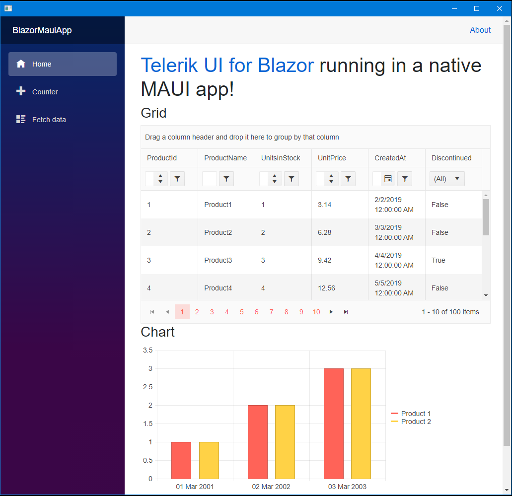
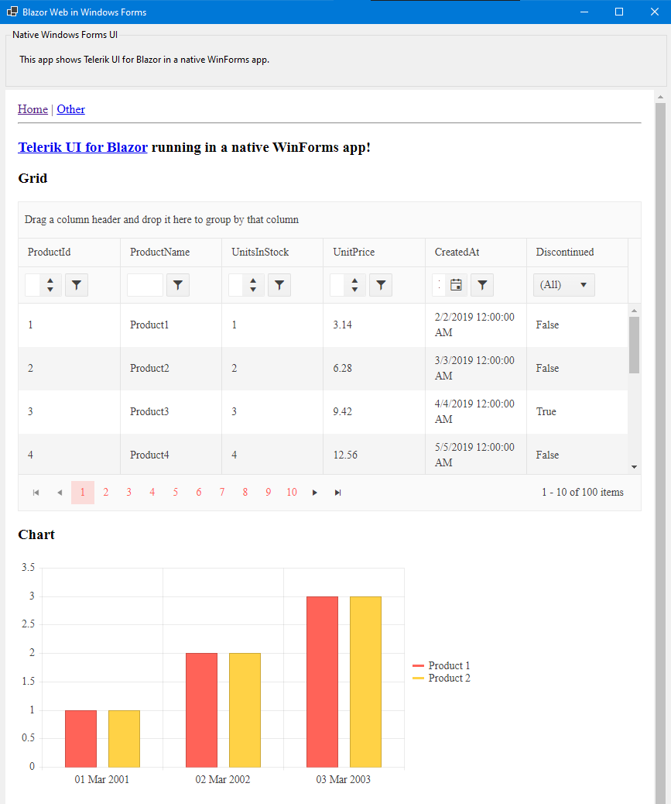
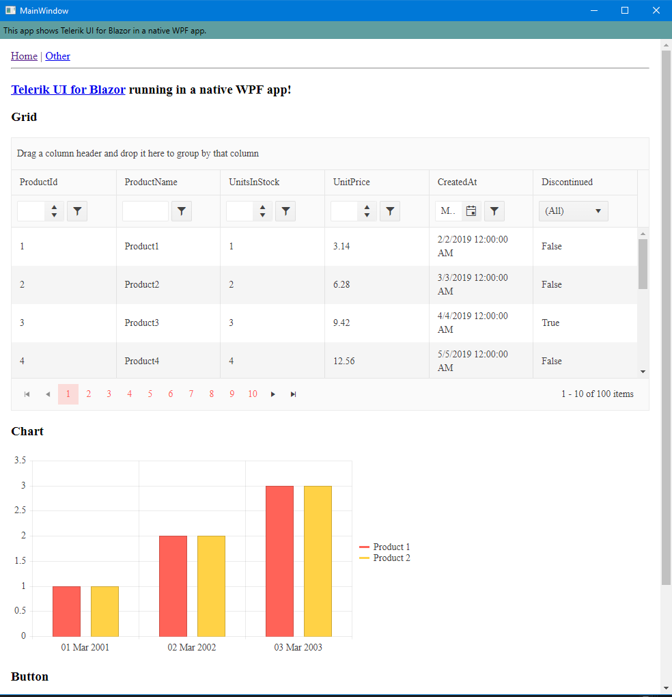

# Hybrid Blazor Apps (Blazor Web apps running in WinForms, WPF, MAUI)

## Overview

With .NET 6.0 an exciting new feature became available - `WebView` for native apps that is dedicated to running Blazor Web applications.

The samples in this project demonstrate how to run Telerik UI for Blazor web components in hybrid scenarios inside MAUI, WPF and WinForms apps.

> **Note:** If you want to learn more about how to start building MAUI apps, visit the official MAUI documentation at: https://docs.microsoft.com/en-us/dotnet/maui/get-started/first-app?pivots=devices-windows

## Screenshots

Here's how the hybrid apps look like when they are run on the different platforms with a similar configuration of Telerik UI for Blazor components:

### Telerik UI for Blazor MAUI App

### Telerik UI for Blazor WinForms App

### Telerik UI for Blazor WPF App

## Installation Prerequisites

You need to make sure you can run the corresponding technology stack and the basic Hybrid Blazor WebView in it **before** using the Telerik components. You can find some details in the [How to run](#how-to-run) section below.

## Key Points About the Telerik Components

Comments in the code offer some more insights, the key points pertaining to the Telerik components are:
* The native app project needs to reference the Telerik UI for Blazor package.
* You add the Telerik static assets in the `index.html` file as usual.
* The `TelerikRootComponent` should be added as a top-level component in the Blazor app. Since custom layouts are not supported as of this writing (might be changed in the future) add it to the `Shared/MainLayout.razor` file (`Main.razor` is also possible depending on the app) component.
    * Make sure that the Telerik root component matches the webview viewport. In this sample, we need to remove the default margin and padding from the body to ensure the content matches the viewport. An extra element in the layout provides paddings.
    * It is expected that layouts should be supported in the future so you would be able to set this up in the same way as with regular Blazor web apps.

These sample apps contain just a few commonly used Telerik components such as a grid, chart, button, date picker to showcase things work.

## How to run

1. Install the latest version of [.NET 6.0](https://dotnet.microsoft.com/download/dotnet/6.0/).
    * Note: It requires <a href="http://visualstudio.com/preview" target="_blank">Visual Studio 2022 Preview for Windows</a> or <a href="https://docs.microsoft.com/visualstudio/releasenotes/vs2019-mac-preview-relnotes" target="_blank">for Mac</a>.
1. Install [WebView](https://devblogs.microsoft.com/aspnet/asp-net-core-updates-in-net-6-preview-3/#blazorwebview-controls-for-wpf-windows-forms).
1. Make sure you have the necessary bits to work with WinForms/WPF/MAUI apps:
    * For MAUI installation, follow the instructions in the official [documentation](https://docs.microsoft.com/en-us/dotnet/maui/get-started/installation)
1. Run a WinForms/WPF/MAUI app
    * For MAUI, follow the instructions for how to [run the app](https://docs.microsoft.com/en-us/dotnet/maui/get-started/first-app?pivots=windows)
> **Note:** For MAUI, make sure you are able to run the default template project (created from either Visual Studio 2022 or the CLI) before proceeding. Having an incomplete installation of MAUI will prevent you from running any app, including the provided sample apps.
5. Use the latest Telerik UI for Blazor version in [your nuget feed](https://docs.telerik.com/blazor-ui/installation/nuget).

## Known issues

1. Running MAUI apps might require developer mode to be [enabled](https://stackoverflow.com/questions/36324300/ensure-that-target-device-has-developer-mode-enabled-could-not-obtain-a-develop)
1. iOS apps are not runnable on Windows - see the [blog post](https://devblogs.microsoft.com/aspnet/asp-net-core-updates-in-net-6-preview-4/#ios-and-mac-catalyst)
> You can’t currently run the app for iOS or Mac Catalyst from a Windows development environment,

## Notes

A couple points to consider:

* There is no debugging protocol exposed for the webview, so inspecting content and debugging is difficult.
* Access to native APIs from the Blazor Web app code is still to be exposed by the framework - at the moment you have to write your own calls to services and code from the native app that you need to explicitly expose.
* The WebView is not on the [list of officially supported browsers by Telerik UI for Blazor](https://docs.telerik.com/blazor-ui/browser-support). It has its specifics and differences from a standalone browser, and the hybrid blazor app integration should be considered a proof-of-concept for the time being. As the technology and framework matures, we will be monitoring it and we will consider adding it to the list of officially supported environments.
