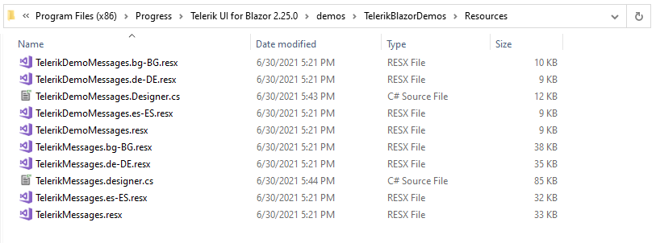

# Localization Examples

These samples show samples of implementing custom [services that localize the Telerik UI for Blazor components](https://docs.telerik.com/blazor-ui/globalization/localization). There is a server-side Blazor and a client-side Blazor (WASM) sample.

You can refer to our demos solution for an up-to-date sample `TeleriMessages.resx` file with the keys used by the components in the respective version and a sample implementation of a localization service. The local path to the `TelerikMessages.resx` files is showcased in the screenshot below.

You can find translations provided by the community, and contribute your own, in the following repository: [UI for Blazor: Translation of TelerikMessages](https://github.com/telerik/blazor-ui-messages)
