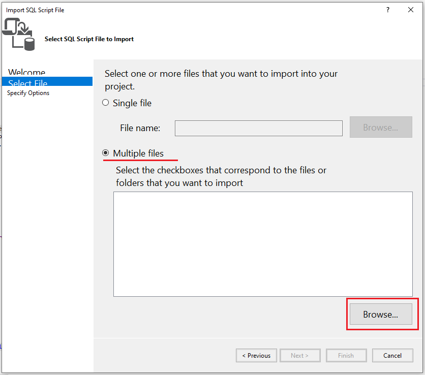
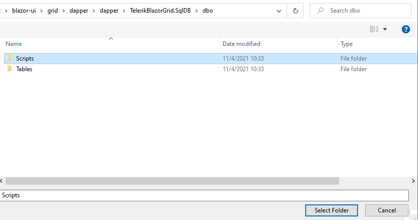
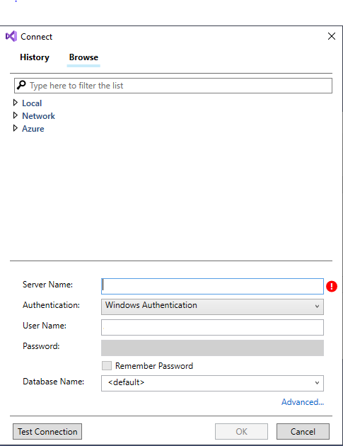
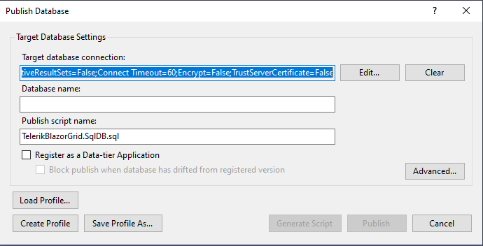
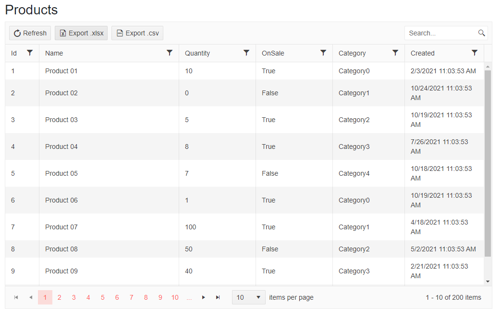

# TelerikBlazorGrid-Dapper

Demonstrates a Telerik Grid in Blazor, using the OnRead event along with Dapper and Dapper.SqlBuilder, to generate your SQL queries on the fly supporting most aspects of Telerik Grid.
Telerik Grid works nicely with Entity Framework, you can use `.ToDataSourceResultAsync()` and everything for sorting etc happens on the database. If you are using Dapper you can use that, however as Dapper doesn't return an IQueryable, you will be fetching the entire dataset and then filtering, paging and sorting in code, rather than on your database.

**Special thanks to @pingu2k4 for the sample.**

## Features
- [x] Paging
- [x] Sorting
- [x] Filtering
- [ ] Grouping
- [ ] Aggregate Information

## Setup
1. Open the project, right click on the `TelerikBlazorGrid.SqlDB.sqlproj` file and then `Import` -> `Script(*.sql)`
2. Click **Next** on the window that popped
3. After that, choose **Multiple files** and click **Browse...**

    
4. Select the **Scripts** folder in the project and click **Finish**

    
5. Right click again on the `TelerikBlazorGrid.SqlDB.sqlproj` file and then `Publish...`
6. Click **Edit** in the popped window
7. Type **Server Name** and **User Name** from your SQL Server

    
8. Copy the generated connection string and close the window

    
9. Paste the connection string in the `appsettings.Development.json` file and you are ready to go

## The Magic
If you are looking for where the majority of the code that performs this is held, take a look at `TelerikBlazorGrid_Dapper.DataAccess.Extensions.SqlBuilderExtensions`. We build up 2 sql templates, one for the query to get our data, and another to query the total count.
By default, you should only need to provide this method the table (or view) name you wish to query. However there are instances where you wish to query a different table or view for both the data selection and the count - For example where you have a view containing a join as the count will become inaccurate, counting all the duplicate rows.
You may also specify a different default sort field and direction.

## The Result
This picture shows the end result. A table with full sort, filter and paging functionality - Using OnRead through dapper, and passing the handling of all the Grid functionalities over to the database.

## Disclaimer
Integration with Dapper is not subject to technical support by Progress.
