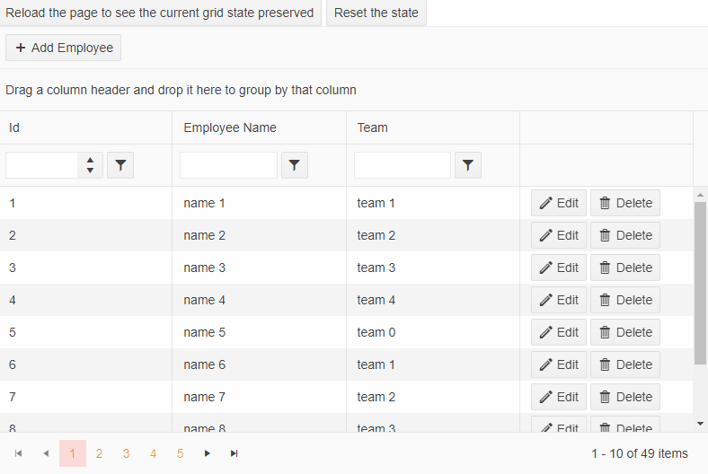

# Saving Grid State in a Blazor WebAssembly project through a controller

This example shows how you can save the state of the Grid in a WASM project through a **Controller** and **LocalStorage** service. 

Using a controller, we save the state in a property for the demo. In a real case, the state should be saved in a **database**. The state won't be persisted after **refresh** on the controller page since the property value will be disposed of.

Saving the state into the browser's LocalStorage through a service lets you persist the state even after page **refresh**.

The result from the example with controller:

The result from the example with LocalStorage service:

