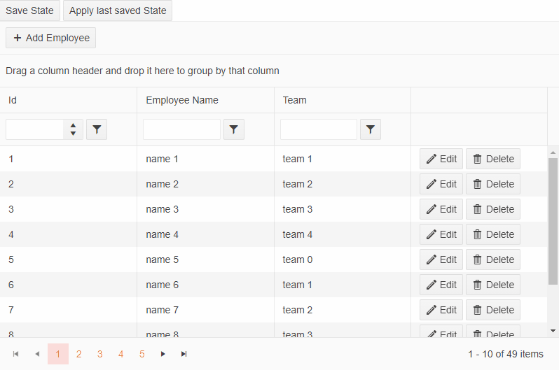

# Saving Grid State in a Blazor WebAssembly project through a controller

This example shows how you can save the state of the Grid in a WASM project. Using a controller, we save the state in property for the demo. In a real case, the state should be saved in a **database**.

The result from the example:

