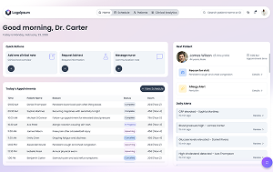

<div align="center">
  <a href="https://www.telerik.com/blazor-ui"></a>
</div>

# Healthcare Application — Telerik UI for Blazor

A full-featured healthcare dashboard built with [Telerik UI for Blazor](https://www.telerik.com/blazor-ui), designed to demonstrate how clinical workflows can be modeled in a modern Blazor application.

The app is organized into four main views:

- **Patients** — A searchable, sortable, and filterable grid of patients with vitals, risk levels, and lab results. Includes an AI Assistant panel and Excel export.
- **Patient Profile** — Detailed view of an individual patient showing basic information, recent vitals (heart rate, blood pressure, O₂ saturation, temperature), a rich-text editor for clinical notes, and lab results.
- **Schedule** — A multi-view scheduler (day, week, month, agenda) for managing appointments, paired with a daily task list that supports search and inline task creation.
- **Clinical Analytics** — Charts tracking patient vitals over time (systolic/diastolic BP, heart rate, SpO₂, temperature), alert distribution, and a risk assessment gauge.

<div align="center" style="margin: 25px 0;">
  
</div>

## Components Used

| Category | Components |
|----------|-----------|
| Data Grids | Grid |
| Scheduling | Scheduler |
| Charts | Chart (Line, Column, Area, Donut) |
| Gauges | ArcGauge |
| DropDowns | DropDownList, MultiSelect, AutoComplete |
| Editors | Editor, TextBox, TextArea |
| Chat | Chat (AI Assistant) |
| Lists | ListView |
| Inputs | CheckBox, Form |
| Buttons | Button, Chip |
| Layout | AppBar, Window, Popup, Popover |
| Indicators | Badge |
| Icons | SvgIcon |

## Getting Started

### Prerequisites

- [.NET 10 SDK](https://dotnet.microsoft.com/download/dotnet/10.0)
- [Telerik UI for Blazor](https://www.telerik.com/blazor-ui) (commercial or trial license)
- Telerik NuGet feed configured ([instructions](https://docs.telerik.com/blazor-ui/installation/nuget))

### Running the Application

```bash
# 1. Clone the repository
git clone https://github.com/telerik/blazor-ui.git

# 2. Navigate to the project folder
cd sample-applications/blazor-healthcare-app/BlazorHealthcareApp

# 3. Restore dependencies
dotnet restore

# 4. Run the application
dotnet run
```

Navigate to `https://localhost:7253/`. The app supports hot reload during development.

## Build

```bash
dotnet build
```

Build artifacts are stored in the `bin/` directory.

## Additional Links

- [Telerik UI for Blazor Documentation](https://docs.telerik.com/blazor-ui/introduction)
- [Telerik UI for Blazor Demos](https://demos.telerik.com/blazor-ui)
- [Submit Issues](https://github.com/telerik/blazor-ui/issues)
